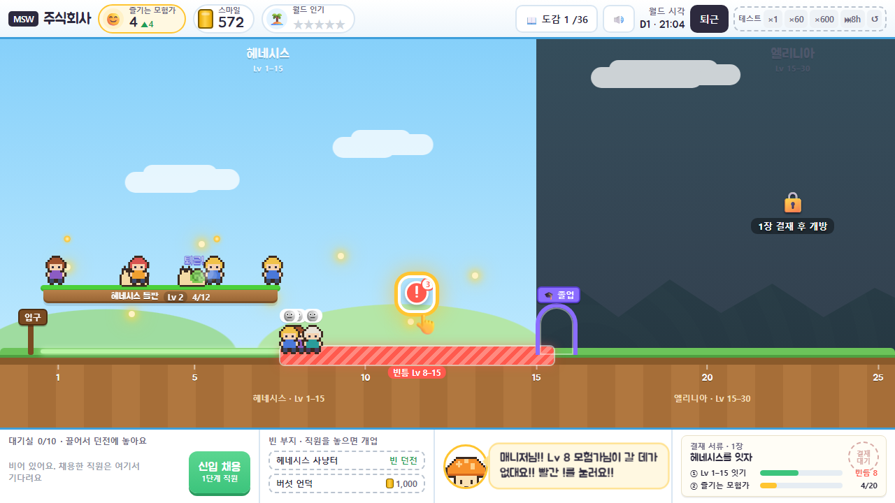
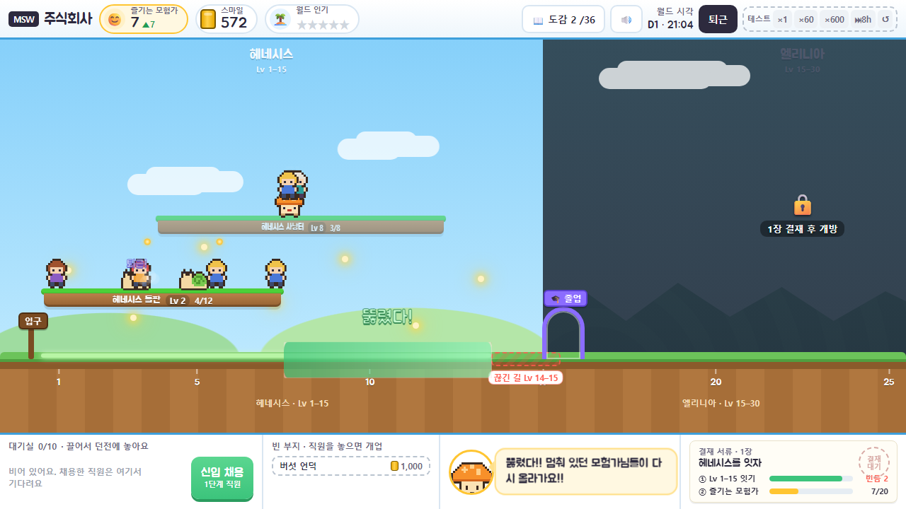
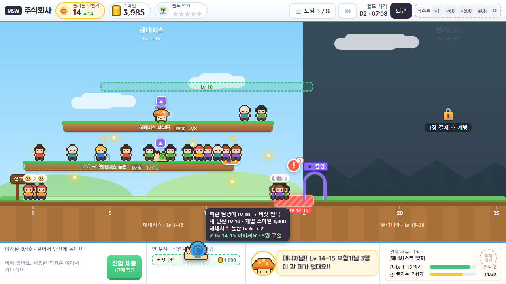
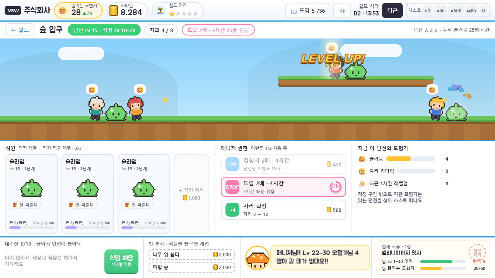
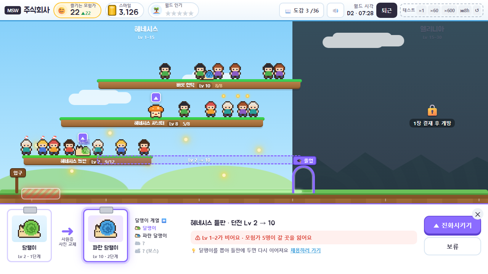
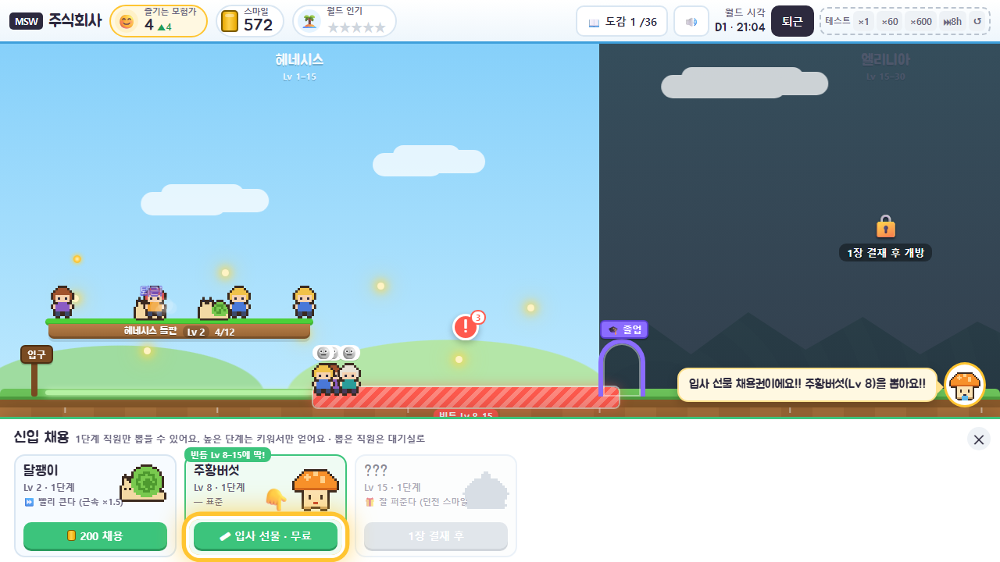
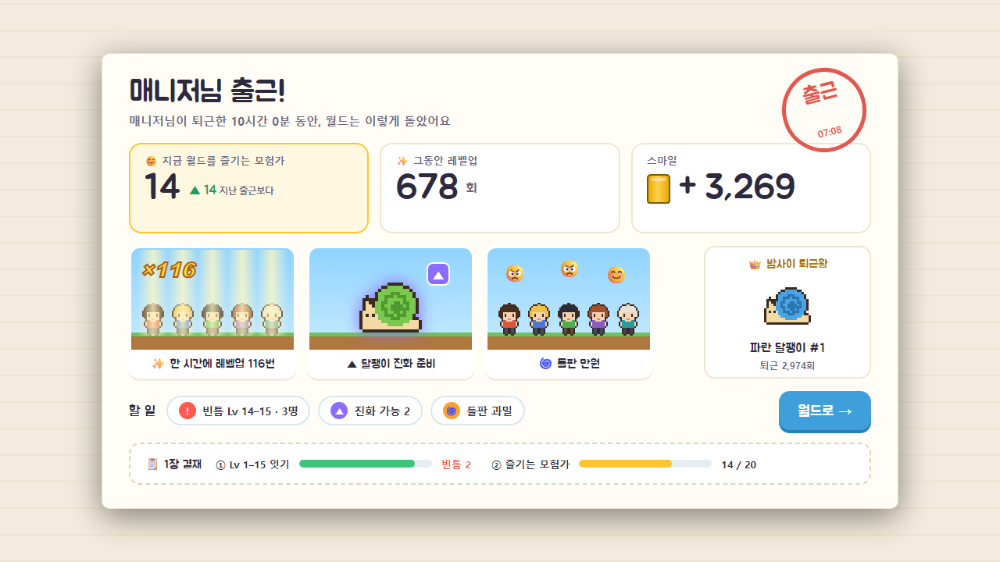
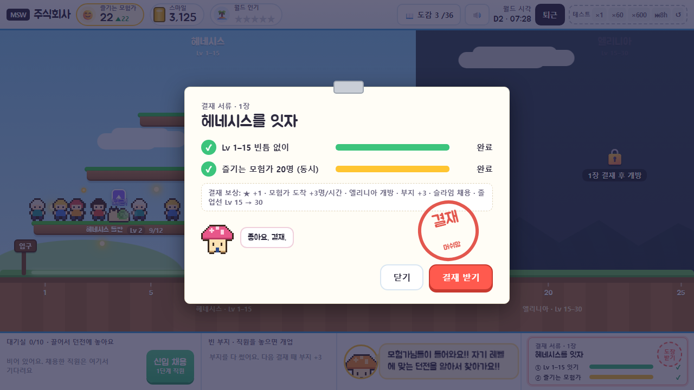
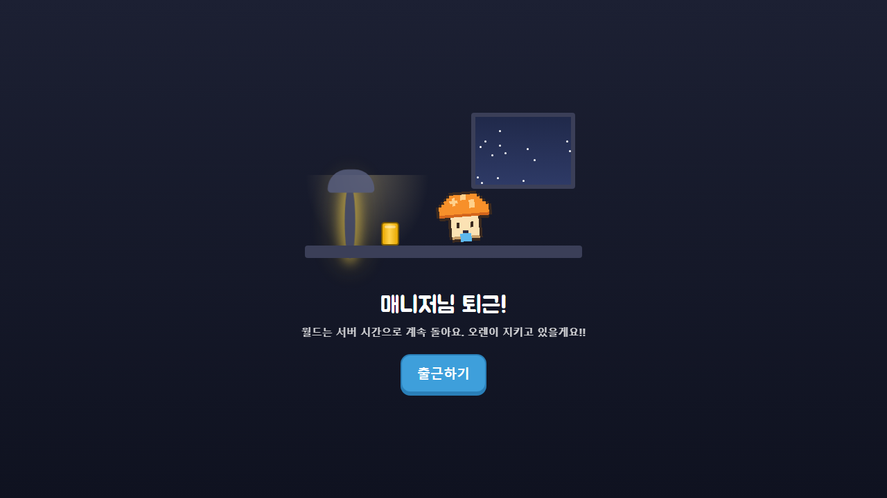

# 04 — 화면 · 인터랙션 · 피드백

> MSW 주식회사 · v1.1 · 2026-09-25 · [README](./README.md) · 바뀐 점은 [05 리뷰](./05-review.md)
>
> **이 문서가 답하는 질문:** 경험([02](./02-player-experience.md))과 규칙([03](./03-systems.md))이 화면에서 어떻게 보이고, 플레이어는 무엇을 어떻게 만지는가.
>
> **모든 그림은 플레이 프로토타입의 실제 화면이다.** [prototype/index.html](./prototype/index.html)을 브라우저로 열면 그대로 플레이된다. 그림은 `bash prototype/render.sh`로 다시 굽는다(`index.html?demo=<장면>`). 몬스터와 캐릭터 도트는 **자리표시용으로 코드로 그린 것**이고, 실제 게임은 메이플스토리 월드 공식 리소스를 쓴다.
>
> v1.0의 섬 지도형 시안([mockups/](./mockups/))은 폐기했다. 이유는 [05 B1](./05-review.md#3-b-화면--인터랙션--피드백--만져-보면-드러난-것).

## 1. 화면 구조

**화면은 세 겹이다.** 위아래 띠는 어느 화면에서나 그대로이고, 가운데만 바뀐다.

```
┌ HUD ─ 😊 즐기는 모험가 · 스마일 캔 · ★ 월드 인기 ·········· 도감 · 소리 · 월드 시각 · [퇴근] ┐  항상
├──────────────────────────────────────────────────────────────────────────────┤
│  가운데: S1 월드 길  ⇄  S2 던전 현장                                              │  바뀐다
│          (시트: S3 진화 · S5 채용 / 모달: S6 결재 · S0 리포트 · S7 퇴근 · 도감)      │
├──────────────────────────────────────────────────────────────────────────────┤
└ 독 ─ 대기실 + [신입 채용] · 빈 부지 · 오렌 한 줄 · 결재 서류 미니 ─────────────────┘  항상
```

| ID | 화면 | 형태 | 역할 |
|---|---|---|---|
| **S1** | 월드 길 | 가운데 | **메인.** 월드 전체 상태, 고칠 곳, 직원 옮기기 |
| **S2** | 던전 현장 (+ **S4** 매니저 권한) | 가운데 | 한 던전의 구경거리 + 직원 슬롯 + 이벤트·자리 확장 |
| **S3** | 진화 | 하단 시트 | 진화 결정. **월드 위에** 결과를 미리 보여 준다 |
| **S5** | 신입 채용 | 하단 시트 | 1단계 직원 채용. 빈틈에 맞는 계열 추천 |
| **S6** | 결재함 | 모달 | 챕터 결재 서류, 도장, 챕터 컷 |
| **S0** | 출근 리포트 | 전체 | 떠나 있던 동안의 결과. 체크인의 시작 |
| **S7** | 매니저 퇴근 | 전체 | 무입력 끊김 또는 [퇴근] 버튼 |

```
 접속 ─▶ (2분 넘게 떠나 있었으면) S0 출근 리포트 ─ [월드로] / 할 일 칩 ─▶ 바로 그 화면
                                     │
                                     ▼
            ┌───────────── S1 월드 길 ◀──────── [← 월드] ─────── S2 던전 현장
            │   발판 탭 ───────────────────────────────────▶ S2   (슬롯 ▲ ─▶ S3)
            │   ▲ (직원 머리 위) ─▶ S3 진화 시트 (월드 위 미리보기)
            │   ! (땅) ─▶ S5 채용 시트 ─▶ 대기실 토큰 + 추천 자리 발광 ─▶ 드래그
            │   🌀 (발판 끝) ─▶ S2 (자리 확장 강조)
            │   결재 미니 ─▶ S6 ─ 도장 ─▶ 챕터 컷 ─▶ S1 (카메라 물러남, 불 켜짐)
            │   직원 드래그 ─▶ 결과 카드 + 유령 발판 ─▶ 놓기
            └── 무입력 끊김 / [퇴근] ─▶ S7 ─ [출근하기] ─▶ S0 (월드 시간 1분 넘게 흘렀으면)
```

**원칙:** 배지를 누르면 **탭 한 번에 그것을 고치는 화면**으로 간다. 결과는 **놓기 전에** 보인다.

---

## 2. S1 · 월드 길 (메인)


**이 화면이 답하는 질문:** "지금 월드에서 **어디를** 고쳐야 하지?" 5초 안에 답이 나와야 한다.

**한 줄 문법: 가로축이 레벨이다.** 왼쪽 입구에서 Lv 1 모험가가 들어와, 레벨업할 때마다 오른쪽으로 걷고, 졸업 문에서 떠난다. 던전은 자기 적정 구간(D±5, 11칸) 너비의 **발판**으로 그 위에 떠 있다. 발판 위에 서 있는 모험가가 즐거운 모험가다. **발판이 없는 땅이 빈틈**이다. 규칙 R1·R2가 설명 없이 눈에 보인다.

| # | 요소 | 보여주는 것 | 규칙 | 조작 |
|---|---|---|---|---|
| ① | **땅과 눈금** | Lv 1, 5, 10, 15… 지역 이름과 범위(헤네시스 · Lv 1–15) | 1장 Lv 0~25, 2장 0~40, 3장 0~55가 한 화면. 결재하면 카메라가 물러난다 | — |
| ② | **발판 = 던전** | 이름, 던전 Lv, 즐기는 인원/자리(6/8). 윗면 색 = 던전 레벨(연두 → 보라) | 폭 = 적정 구간. 겹치는 발판은 층을 나눠 쌓는다(한번 앉은 층은 되도록 유지) | 탭 → S2. 직원을 끌어다 놓는 목적지 |
| ③ | **직원** | 발판 위를 천천히 오가는 몬스터. 가끔 "퇴근!" 펑 하고 사라졌다 돌아온다 | — | 탭 → 직원 말풍선(근속, 진화, 현장 보기, 대기실로). **끌면 옮기기** |
| ④ | **모험가** | 자기 레벨 위치에 선 사람. 레벨업하면 작은 빛기둥 + UP, 오른쪽으로 한 칸 | 경험치가 차는 만큼 칸 안에서 조금씩 오른쪽으로 이동한다 | — (개인 정보 없음, P4) |
| ⑤ | **끊긴 길** | 옅은 빨간 점선 + "끊긴 길 Lv 14–15" | 막힌 사람이 없을 때. 아직 경고가 아니다 | 라벨 탭 → S5 |
| ⑥ | **빈틈** | 빨간 빗금 + 떠 있는 `!` 배지 + 멈춘 인원. 모험가가 땅에 멈춰 😐 | 막힌 사람이 있을 때만. **빨강은 지금 고칠 곳에만** | `!` 탭 → S5 (빈틈에 맞는 계열 추천) |
| ⑦ | **🌀 과밀** | 발판 오른쪽 끝의 주황 알약 "🌀 5". 발판 아래 땅에 😠로 기다리는 사람 | 자리가 없어 30분 기다리면 떠난다 | 탭 → S2 (자리 확장 강조) |
| ⑧ | **▲ 진화** | 직원 머리 위 보라 배지가 통통 뛴다 | 좋은 소식이라 급하지 않다 | 탭 → S3 |
| ⑨ | **이벤트 링** | 발판 끝의 파랑(EXP)·분홍(DROP) 시간 링 + 발판 뒤 옅은 빛 | 남은 시간이 링으로 줄어든다 | — |
| ⑩ | **입구 · 졸업 문** | 왼쪽 나무 푯말, 오른쪽 보라 아치 "🎓 졸업" | 졸업 문 = 졸업선. 결재하면 오른쪽으로 옮겨 간다 | — |
| ⑪ | **지역 안개** | 잠긴 지역은 어두운 안개 + 🔒 "N장 결재 후 개방" | 섬의 밝기가 곧 진척(F4) | — |
| ⑫ | **스마일 알갱이** | 즐거운 모험가에게서 노란 알갱이가 HUD 캔으로 날아간다 | 수입을 샘플로 보여 준다 | — |

**배지는 문제가 있는 그 물건 위에 뜬다.** `!`는 땅(던전 사이의 문제), 🌀는 발판(던전의 문제), ▲는 직원(직원의 일). v1.0의 "카드당 배지 하나" 규칙은 진화 배지를 과밀 배지가 가려서 버렸다.

**정보 예산:** 화면의 글은 발판 이름·숫자, 빈틈 라벨, 오렌 1줄이 전부다(P3).

### 빈틈이 생기고 메워지는 순간 (F3)

| 멈춤 | 뚫림 |
|---|---|
|  |  |
| Lv 8이 된 모험가가 발판 끝에서 떨어져 땅에 멈춘다. 끊긴 길이 빨간 빈틈으로 바뀌고 `!` + 인원 | 새 발판이 생기면 빗금이 왼쪽부터 초록으로 쓸린다. "뚫렸다!" + "뽁". 멈춰 있던 사람들이 줄줄이 뛰어오른다 |

### 직원 옮기기 — 놓기 전에 결과를 본다



- **끌 수 있는 것:** 발판 위 직원, 대기실 토큰.
- **놓을 수 있는 곳:** 다른 발판, 독의 빈 부지(놓으면 개업. 비용 표시), 대기실. 평소 독에는 빈 부지가 두 칸(추천 → 열린 빈 던전 → 싼 순)만 보이고, **끌기 시작하면 전부 위로 펼쳐진다.**
- **끄는 동안:** 목적지가 하얗게(가능) 또는 빨갛게(불가) 테두리. 월드 위에 **유령 발판**(초록 점선 = 옮긴 뒤 자리)이 뜨고, 비게 될 땅에 빨간 예고 빗금이 깜빡인다. 포인터 옆 **결과 카드**가 한 줄씩 말한다.
  - 대상: "파란 달팽이 Lv 10 → 버섯 언덕"
  - 레벨 변화: "새 던전 Lv 10 · 개업 스마일 1,000", "헤네시스 들판 Lv 6 → 2"
  - 결과: "✓ Lv 14–15 이어져요 · 3명 구출" 또는 "✕ Lv 1–2 비어요 · 4명 갈 곳 잃음", 또는 "빈틈 변화 없음"
  - 불가: "✕ 직원 자리가 꽉 찼어요", "✕ 보스는 던전에 한 마리만"
- **놓으면:** "탁" + 발판이 새 자리로 미끄러진다. 개업은 5초 되돌리기(그 부지에 놓은 직원은 모두 대기실로).
- **탭(끌지 않음):** 직원 말풍선 — 이름·단계·특성·근속 게이지, [▲ 진화] [현장 보기] [대기실로].

### S1-m · 모바일 세로 (프로토타입 미구현)

| PC | 모바일 세로 | 이유 |
|---|---|---|
| 가로축 = 레벨, 왼쪽 → 오른쪽 | **세로축 = 레벨, 아래 → 위.** 원작의 밧줄·사다리처럼 "올라간다" | 좁고 긴 화면에 레벨 70칸이 들어가고, F1 "올라간다"가 말 그대로 된다 |
| 발판을 층으로 쌓음 | 발판이 기둥 좌우로 번갈아 붙음 | 엄지 스크롤 한 방향 |
| 드래그 | 길게 누르기 → [옮기기] 시트(발판 목록 + 결과 한 줄씩) | 세로 스크롤과 충돌하지 않게 |
| 독 | 하단 탭 4개(월드, 직원, 결재함, 도감) + 오렌 말풍선 | 엄지 영역 |

---

## 3. S2 · 던전 현장 (+ S4 매니저 권한)



**이 화면이 답하는 질문:** "이 던전은 잘 돌고 있나? 여기서 무엇을 바꿀까?" 그리고 **구경의 즐거움**(F1, F5).

| # | 요소 | 보여주는 것 | 조작 |
|---|---|---|---|
| ① | **머리 띠** | [← 월드] · 던전 이름 · "던전 Lv 15 · 적정 Lv 10–20"(R1을 매번 상기) · 자리 2/8 · 이벤트 칩(남은 시간) · 던전 ★ · 누적 즐거움 | ← 또는 Esc → S1 |
| ② | **현장** | 원작 필드처럼 땅 + 떠 있는 발판. 직원은 3마리부터 발판에도 선다. 모험가는 최대 12명까지 샘플로 걸어 들어와 직원 양옆에 선다 | — |
| ③ | **전투** | 휘두르기 + 칼자국, 맞은 직원이 하얗게 번쩍 | — |
| ④ | **퇴근** | 서버가 낸 퇴근 수를 샘플로 재생(초당 최대 2회): 연기 펑 + "퇴근!" + "+😊" 알갱이가 캔으로. 1.4초 뒤 "출근! 🪪" | — |
| ⑤ | **레벨업** | 원작 빛기둥 + **LEVEL UP!** + 새 레벨 + 징글 | — |
| ⑥ | **떠나는 모험가** | 적정 구간을 벗어나면 꼬리표 "Lv 21 · 나무 위 쉼터로 →" 또는 "갈 곳을 찾는 중 😐"를 달고 오른쪽으로 걸어 나간다 | — |
| ⑦ | **직원 슬롯** | 이름, Lv·단계, 특성, 근속 게이지. 가득 차면 보라 테두리 + [▲ 진화 가능]. 빈 칸은 [+ 신입 채용], 끝에 [+ 직원 자리 1,000] | ▲ → S3(월드로 나가서 미리보기). 빈 칸 → S5(뽑으면 **이 던전에 바로 배치**) |
| ⑧ | **매니저 권한 (S4)** | 경험치 2배 / 드랍 2배 / 자리 확장. 효과 한 줄("위로 올려보낸다", "불러 모은다"), 비용(첫 번은 무료). 진행 중이면 링. 던전당 이벤트 하나, 월드 동시 N개 | 탭 즉시 시작 + 5초 되돌리기 |
| ⑨ | **표정** | 😊 즐거움 n / 😠 자리 기다림 n / ✨ 최근 1시간 레벨업 | — |

**이벤트를 거는 순간:** 화면 가운데 "EXP ×2!" 또는 "DROP ×2!" 배너, 모든 모험가에게 파란·분홍 고리가 퍼진다. 이후 레벨업·스마일이 실제로 두 배로 잦아진다. v1.0의 "1초 안에 빛기둥 2~3개"는 규칙상 지킬 수 없어 버렸다.

**현장은 결과를 바꾸지 않는다.** 화면 속 모험가는 샘플이고, 퇴근과 레벨업 연출은 서버가 이번 분에 낸 사건을 재생한다([03 §8](./03-systems.md#8-시뮬레이션--서버-시간)).

---

## 4. S3 · 진화 — 결과를 월드 위에서 본다



**이 화면이 답하는 질문:** "지금 진화시켜도 되나?" **가장 흥미로운 결정**이다. 그래서 월드를 가리지 않는다. 시트는 아래에서 올라오고, 위쪽 월드 길이 곧 미리보기다.

| # | 요소 | 보여주는 것 | 규칙 |
|---|---|---|---|
| ① | **사원증 두 장** | 지금 모습 → 진화 후. 처음 보는 단계는 **실루엣 + ???** | 수집 욕구(F2)를 결정 순간에 건다 |
| ② | **계열 도감** | 이 계열의 단계 목록. 가진 것은 도트, 다음 단계는 "NEW?", 나머지는 ? | — |
| ③ | **던전 변화** | "헤네시스 들판 · 던전 Lv 2 → 10" | — |
| ④ | **결과 한 줄** | 초록 "✓ 빈틈이 생기지 않아요" 또는 빨강 "⚠ Lv 1–2가 비어요 · 모험가 4명이 갈 곳을 잃어요" | **월드 전체 기준.** 다른 던전이 덮어 주면 빈틈이 아니다 |
| ⑤ | **힌트** | "💡 달팽이를 뽑아 들판에 두면 다시 이어져요 [채용하러 가기]" 또는 "보류해도 벌칙은 없어요" | 문제와 해결을 같은 화면에 |
| ⑥ | **월드 위 미리보기** | 보라 점선 **유령 발판**(진화 뒤 자리) + 땅의 **빨간 예고 빗금** + 갈 곳 잃을 모험가 머리 위 점선 표정 | 트레이드오프를 결정 전에 눈으로 |
| ⑦ | **버튼** | [▲ 진화시키기] [보류] | 보스 자리 충돌이면 진화 버튼이 잠기고 이유가 뜬다 |

**진화 연출:** 화면 번쩍 → 가운데 사원증이 **뒤집히며** 새 모습 → 진화 팡파르 → "NEW · 도감 +1" 리본 → "파란 달팽이가 됐어요!" → 닫으면 발판이 오른쪽으로 미끄러지고, 빈틈이 생겼다면 그 자리에 빗금이 나타난다.

---

## 5. S5 · 신입 채용



- **시트 한 장.** 지금 뽑을 수 있는 계열의 1단계만 카드로(도트, 이름, Lv, 특성과 효과, 비용). 다음 챕터 계열은 실루엣 + "N장 결재 후"로 한 장 미리 보여 준다.
- **추천:** 첫 빈틈을 메울 수 있는 계열에 초록 리본 "빈틈 Lv 8–15에 딱!".
- **비용 버튼:** 스마일이 모자라면 회색. 누르면 빨간 토스트 "스마일 120 모자라요". 입사 선물은 "🎟 입사 선물 · 무료".
- **뽑은 뒤:**
  - 월드에서 열었으면 → 대기실 토큰이 튀어 오르고, **빈틈을 가장 줄이는 자리**(발판 또는 빈 부지)가 초록으로 빛난다. 오렌: "대기실에 주황버섯이 기다려요!! 초록으로 빛나는 곳에 놓아주세요!!"
  - 던전 현장에서 열었으면 → 그 던전에 **바로 배치.** 대기실이 꽉 차 있어도 된다.
  - 5초 되돌리기.
- 시트가 독을 덮는 동안 **오렌이 시트 위로 떠올라** 한 줄을 계속 말한다.

---

## 6. S0 · 출근 리포트



**이 화면이 답하는 질문:** "내가 없는 동안 어떻게 됐지?" 그리고 **"오늘은 뭘 하면 되지?"**

| # | 요소 | 규칙 |
|---|---|---|
| ① | **제목 + 출근 도장** | "매니저님 출근!" + 퇴근해 있던 시간. 도장이 "탁" 찍히며 등장 |
| ② | **숫자 세 개** | 😊 지금 월드를 즐기는 모험가(**지난 출근보다 ▲N**, 줄었으면 화살표 없음) · ✨ 그동안 레벨업 · 스마일. 굴러가며 올라간다. **셋 다 늘어 있다** |
| ③ | **명장면 카드 최대 세 장** | 그림 한 장 + 10자 캡션. 순서: 결재 서류 도착 > 첫 졸업 > 한 시간에 레벨업 N번 > 진화 준비 > 졸업 N명 > 만원 |
| ④ | **밤사이 퇴근왕** | 떠나 있던 동안 가장 많이 쓰러진 직원. 왕관이 떨어져 씌워진다 (F5) |
| ⑤ | **할 일 칩** | 결재 받기 · 빈틈 Lv a–b · n명(빨강) 또는 끊긴 길 Lv a–b(회색) · 진화 가능 n · ○○ 과밀. **칩을 누르면 그 화면으로 바로 간다** |
| ⑥ | **결재 진행** | 이번 챕터 조건 두 개. 오늘 할 일이 챕터 목표에 어떻게 닿는지 같은 화면에서 보인다 |

**떠나 있던 시간은 서버처럼 한 번에 계산한다**(최대 24시간, 넘으면 오렌이 "매니저님 어디 가셨었어요?!"). 2분 안의 새로고침은 리포트 없이 조용히 계산한다. 떠난 모험가 수는 보여 주지 않는다(P5).

---

## 7. S6 · 결재함과 챕터 컷



- 서류 한 장, 조건 두 개(체크 + 막대), **결재 보상 한 줄**(★ +1 · 도착 +3명/시간 · 새 지역 · 부지 +3 · 새 계열 · 졸업선 이동), 머쉬맘 한 줄.
- 조건을 채우면 독의 결재 미니에 **"도장 받기"가 빨갛게 뛴다.** 매니저가 없을 때 채워도 서류가 올라와 기다린다.
- [결재 받기] → 도장이 크게 떨어져 "쾅" + 화면 흔들림 → **챕터 컷**(검은 배경, "CHAPTER 2 · 2장 엘리니아", 머쉬맘 1줄, 오렌 1줄) → [불 켜러 가기 →] → 월드 길에서 카메라가 천천히 물러나고, 다음 지역의 안개가 걷히고, **등불이 하나씩 켜지고**, 졸업 문이 오른쪽으로 옮겨 간다. 새 구간은 곧바로 **끊긴 길**이다(다음 문제의 시작).
- 5장 서류에는 "주니어 발록 입사 지원서"가 클립으로 붙어 있다.

## 8. S7 · 매니저 퇴근



- 무입력 끊김 또는 HUD [퇴근] 버튼. 불 꺼진 사무실, 책상 위 스마일 캔, 창밖 별, 오렌이 손을 흔든다. "매니저님 퇴근! 월드는 서버 시간으로 계속 돌아요. 오렌이 지키고 있을게요!!"
- 버튼 하나: **[출근하기]** → S0.
- 끊김을 막는 입력은 만들지 않는다(P5). 자발적 [퇴근]은 하루를 닫는 의식이다.

---

## 9. 피드백 사전

**모든 사건은 시각, 소리, 숫자 중 적어도 둘로 전달한다. 글은 쓰지 않거나 10자 안팎으로 쓴다** (P3).

| 사건 | 시각 | 소리 | 숫자 | 어디서 |
|---|---|---|---|---|
| 모험가 입장 | 입구에서 걸어 나와 맞는 발판으로 뛰어오른다. 맞는 발판이 없으면 입구에 😐로 멈춘다(빈틈 Lv 1–) | — | 😊 +1 | S1 |
| 몬스터 퇴근 | 연기 펑 + "퇴근!" → 1.4초 뒤 "출근! 🪪" | 퇴근 펑 (신규) | +😊 | S2 (S1에서는 가끔, 소리 없이) |
| 스마일 획득 | 노란 알갱이가 HUD 캔으로 날아가고 캔이 꿀꺽 | 원작 메소 소리 → 스마일음 | 캔 숫자 굴러감 | S1, S2 |
| **모험가 레벨업** | 현장: 원작 빛기둥 + LEVEL UP! / 월드: 작은 빛기둥 + UP, 오른쪽으로 한 칸 | 원작 레벨업 징글 (월드는 짧게) | 새 레벨 | S2, S1 |
| 모험가 이동 | 발판에서 발판으로 포물선 점프 | — | 발판의 n/자리 | S1 |
| 😐 갈 곳 없음 | 땅에 멈춰 선 회색 😐. 끊긴 길이 빨간 빈틈으로 | — | `!` 배지의 인원 | S1 |
| 😠 붐빔 | 발판 아래 땅에 😠, 발판 끝 🌀 n | — | 🌀 n | S1, S2 |
| 😢 떠남 | 😢 뜨고 흐려지며 왼쪽으로 | — | **누적 표시 없음** | S1 |
| 🎓 졸업 | 졸업 문으로 걸어가 하늘로 + 폭죽 | 짧은 팡파르 (신규) | +20 | S1 |
| 진화 가능 | 직원 머리 위 보라 ▲가 통통, 슬롯 보라 테두리 | — | 근속 게이지 가득 | S1, S2 |
| **진화** | 번쩍 → 사원증 뒤집기 → NEW 리본 → 발판이 오른쪽으로 미끄러짐 | 진화 팡파르 (신규) | Lv +8, 던전 Lv | S3 → S1 |
| 옮기기 미리보기 | 유령 발판, 예고 빗금, 결과 카드 | — | 던전 Lv, 구출·낙오 인원 | S1 |
| 빈틈 발생 | 끊긴 길 → 빨간 빗금 + `!` | — | 멈춘 인원 | S1 |
| **빈틈 해소 (F3)** | 빗금이 초록으로 쓸림 + "뚫렸다!" + 멈춘 사람들이 뛰어오름 | "뽁" (신규) | — | S1 |
| 이벤트 시작 | EXP/DROP ×2! 배너 + 모험가 고리 + 발판 빛 + 시간 링 | 원작 이벤트 알림음 | 남은 시간 | S2, S1 |
| 자리 확장 | "자리 +4" | 채용음 | 자리 n | S2 |
| 채용 | 대기실 토큰이 튀어 오름 + 추천 자리 초록 발광 | 채용음 | 스마일 − | S5 → S1 |
| 못 하는 행동 | 빨간 토스트 한 줄(이유 + 부족분) | **없음** | 모자란 스마일 | 어디서나 |
| 결재 조건 달성 | 독의 결재 미니 "도장 받기"가 빨갛게 뜀 | 알림음 | ✓ | 독 |
| **결재 도장 (F4)** | 도장 쾅 + 흔들림 → 챕터 컷 → 카메라 물러남, 안개 걷힘, 등불이 하나씩 | 결재 쾅 (신규) | ★ +1 | S6 → S1 |
| 매니저 출근 | 출근 도장 "탁" → 숫자 → 명장면 → 퇴근왕 | 출근 탁 (신규) | 세 숫자 | S0 |
| 매니저 퇴근 | 사무실 소등 컷 | — | — | S7 |

**경고음은 없다.** 빨간 배지도, 못 하는 행동도 소리를 내지 않는다([01 §7](./01-tone-and-manner.md#7-사운드)). 신규 효과음은 퇴근 펑, 출근 탁, 결재 쾅, 진화 팡파르, 빈틈 뽁, 졸업 팡파르의 6종이다.

## 10. 인터랙션 규칙

| 규칙 | 내용 |
|---|---|
| 조작은 두 가지 | **탭**(보기, 결정)과 **드래그**(직원 옮기기). 모바일은 드래그 대신 길게 누르기 → 시트 |
| 결과는 놓기 전에 | 옮기기와 진화는 결정 전에 월드 위에 결과를 보여 준다(유령 발판, 예고 빗금, 결과 카드) |
| 확인 창 최소화 | 채용, 이벤트, 자리 확장, 직원 자리 확장, 개업은 탭 즉시 실행 + **5초 되돌리기**. 진화만 시트를 거친다 — 되돌릴 수 없기 때문이다 |
| 한 탭 규칙 | 배지 → 고치는 화면까지 탭 하나. 채용 뒤에는 둘 곳이 먼저 빛난다 |
| 3초 규칙 | 모든 결정의 결과는 3초 안에 화면에 보인다(발판 이동, 빗금 색, 모험가 점프, 칩 숫자) |
| 독은 늘 그 자리 | 대기실·빈 부지·오렌·결재 미니는 어느 화면에서도 같은 곳에 있다. 시트가 덮으면 오렌이 위로 떠오른다 |
| 체크인 예산 | 출근부터 퇴근까지 **탭 15회 이내.** 페이싱 봇 기준 체크인당 행동 2.2~3.0회 |
| Esc | 시트 닫기 → 현장에서 월드로 |

## 11. MSW 구현 메모

| 항목 | 메모 |
|---|---|
| 월드 길 | 가로로 긴 맵 하나에 지역 배경을 구간으로 잇는다(원작 필드 리소스). 발판·배지·빗금은 UI. 카메라 줌 5단계(챕터마다 한 단계) |
| 던전 현장 | 공식 맵(헤네시스 사냥터 등) + 공식 스프라이트 + 표정 이모션 |
| 크기 규격 | 1280×720 기준. 월드 길 모험가 약 30×42, 직원 약 40×36. 현장은 3배 |
| 서버 계산 | [03 §8](./03-systems.md#8-시뮬레이션--서버-시간). 화면은 계산 결과와 사건 목록을 받아 재생한다 |
| 저장 | 서버 저장(프로토타입은 브라우저 저장소로 대신한다) |

## 12. 플레이 프로토타입

| | |
|---|---|
| 여는 법 | [prototype/index.html](./prototype/index.html)을 브라우저로 연다. 설치 없음. 진행은 그 브라우저에만 저장된다 |
| 범위 | 입사 컷 → 첫 10분 튜토리얼 → 1장 헤네시스 → 2장 엘리니아(슬라임) → 3장 페리온(스텀프). 3장 결재 서류는 "프로토타입은 여기까지"로 닫힌다 |
| 테스트 도구 (HUD 오른쪽 점선 칸, 실제 게임에는 없다) | 배속 ×1 / ×60 / ×600, ⏭8h(8시간 뒤 출근), ↺(처음부터, 두 번 눌러야 한다) |
| 시연 장면 | `index.html?demo=` intro · gap · hire · heal · dungeon · drag · evolve · report · approval · ch2 · offduty |
| 파일 | `sim.js` 규칙(03과 같은 수치) · `art.js` 자리표시 도트 · `core.js` 공통 · `world.js` S1 · `dungeon.js` S2·S4 · `sheets.js` S0·S3·S5·S6·S7 · `tut.js` 첫 10분 · `demo.js` 시연 · `main.js` 루프 · `pacing-check.js` 페이싱 점검(Node) |

---

**이 문서가 정한 것:** 세 겹 화면 구조, 월드 길 문법과 요소, 빈틈의 두 표시, 옮기기 미리보기, 던전 현장과 권한, 진화 미리보기, 채용 흐름, 출근 리포트, 결재와 챕터 컷, 퇴근, 피드백 사전, 인터랙션 규칙, 모바일 세로안, 구현 메모, 프로토타입 안내.
**다른 문서로 넘긴 것:** 왜 이 화면인가(경험) → [02](./02-player-experience.md). 숫자의 근거(규칙) → [03](./03-systems.md). 색과 소리의 근거(톤) → [01](./01-tone-and-manner.md). 무엇을 왜 바꿨나 → [05](./05-review.md).
