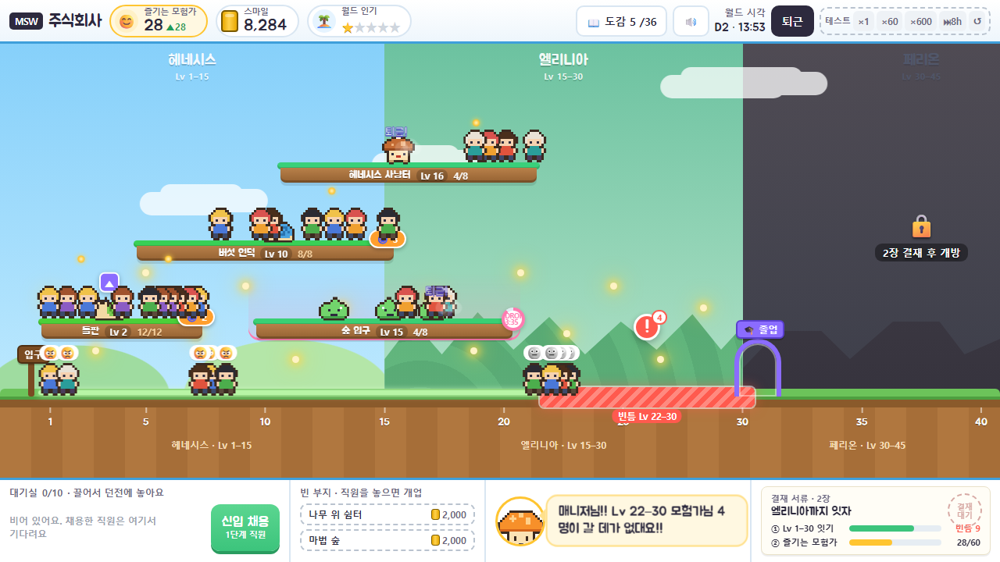

# MSW 주식회사 (가칭)

> 2026-09-25 · 컨셉 구체화 **v1.1** (v1.0 리뷰 반영 + 플레이 프로토타입) · 이전 단계: [사냥터 사장님 v0.2](../hunting-ground-boss/concept.md) → 모험가 아카데미·몬스터 승진·레벨업 루트 비교 → **몬스터 진화 + 월드 레벨업 루트 통합안**

> **정식 프로젝트:** [projects/msw-inc](../../../../projects/msw-inc/README.md) — 5장·엔딩까지 구현. 이 컨셉(v1.1)을 봇으로 굴려 고친 규칙 v1.2와 그 근거는 [선택 점검](../../../../projects/msw-inc/notes/choice-audit.md)에 있다. 이 폴더는 기록으로 둔다.

## 한 장 요약

| | |
|---|---|
| **한 줄** | 몬스터가 직원인 회사에 월드 매니저로 입사해, 몬스터를 키우고 던전을 이어 **모험가들이 이 월드를 좋아하게** 만든다 |
| **장르** | 저관여 월드 매니지먼트 (체크인형 방치) |
| **플랫폼** | 메이플스토리 월드 — 브라우저, 모바일 |
| **톤** | 메이플 × 몬스터 주식회사 오마주의 **밝은 사무실 코미디** |
| **궁극 목표** | 더 많은 모험가(NPC)가 월드를 좋아하고 즐기게 만든다 |
| **핵심 결정** | **"지금 진화시킬까?"** 진화하면 위 구간이 열리지만, 아래 구간이 빈다 |
| **메인 화면** | **월드 길** — 가로축이 레벨. 던전은 자기 적정 구간 너비의 발판, 모험가는 자기 레벨 위치에 선 사람, 발판이 없는 땅이 빈틈 |
| **볼륨** | 메인 엔딩 약 12시간 / 5주, 완전 클리어 약 15시간 / 7주 |
| **해 보기** | [prototype/index.html](./prototype/index.html) — 브라우저로 열면 입사 첫 10분부터 3장 페리온까지 플레이된다 |



## 이름

**정식 가칭: `MSW 주식회사`. 플레이어의 직함: `월드 매니저`.**

- 두 후보를 역할로 나눴다. "주식회사"는 **세계**의 이름(회사 풍자, 몬스터 주식회사 오마주)이고, "매니저"는 **플레이어**의 이름이다.
- MSW는 메이플스토리 월드의 약자이고, 회사 안에서는 **Monster Smile Works**의 약자다. 이 회사는 모험가의 웃음(스마일)을 모아 월드를 밝힌다.
- 회사 슬로건: **"맞아드리는 게 저희 일입니다."**

## 구체화 방향성 — 다섯 원칙

모든 설계 판단은 아래 다섯 원칙으로 결정한다. 문서 곳곳의 선택은 이 원칙 번호로 근거를 단다.

| # | 원칙 | 뜻 | 이 원칙으로 뺀 것 |
|---|---|---|---|
| **P1** | **개념은 세 층, 규칙은 한 줄씩** | 월드 → 던전 → 몬스터 × 모험가. 층마다 플레이어가 기억할 규칙은 하나다 | 3축(경험치·자리·드랍) 교환, 지역별 특수 규칙, 시설 20종 |
| **P2** | **몬스터 레벨 = 던전 레벨** | 두 안(진화 + 루트)을 잇는 단 하나의 연결 고리. 진화하면 던전 레벨이 오르고, 그게 곧 월드 루트를 바꾼다. **화면에서는 레벨이 곧 위치다**(월드 길) | 경로 직접 그리기, 모험가 개별 지시, 섬 지도 |
| **P3** | **읽지 않고 본다** | 피드백은 표정, 빛, 흐름, 숫자 세 개. 문장은 10자 안팎 | 리뷰 문장 800줄 |
| **P4** | **경험 가치가 없는 곳에 디테일을 쓰지 않는다** | 모험가 개인 이름·스탯, 직업 밸런스, 몬스터 세부 스탯은 없다. 직업은 외형뿐이다 | 개체별 관리, 대사량, 세부 설정 |
| **P5** | **떠나 있어도 망하지 않는다** | 월드는 서버 시간으로 돈다. 안 들어오면 느려질 뿐 줄지 않는다. 접속 종료는 "매니저 퇴근" | 끊김 방지 입력, 하락·파산 |

## 개념 계층

```
월드 (빅토리아 아일랜드)                  목표: 모험가가 월드를 좋아하게
 │   규칙: 모험가는 자기 레벨에 맞는 던전을 스스로 찾아간다. 없으면 떠난다
 │
 ├─ 던전 (사냥터) × 15                    도구: 몬스터 배치, 경험치·드랍 이벤트
 │   규칙: 던전 레벨 = 배치된 몬스터의 평균 레벨
 │
 └─ 몬스터 (직원)  ×  모험가 (NPC 손님)
     규칙: 몬스터는 퇴근할수록   규칙: 모험가는 즐거우면
           진화한다                  레벨업하고, 위로 올라간다
```

**몬스터도 자라서 위로 가고, 모험가도 자라서 위로 간다.** 월드는 둘이 함께 오르는 사다리다. 매니저는 선을 긋지 않는다. 던전의 레벨만 정하면 모험가가 알아서 찾아간다.

## 문서 지도

각 문서는 단독으로 읽혀도 완결되도록 썼다.

| 문서 | 답하는 질문 |
|---|---|
| [01-tone-and-manner.md](./01-tone-and-manner.md) | 이 게임은 어떤 느낌인가? 시놉시스, 인물, 개그 규칙, 비주얼, 사운드, 글 톤 |
| [02-player-experience.md](./02-player-experience.md) | 플레이어는 무엇을 느끼고, 무엇을 하는가? 핵심 재미, 목표 구조, 코어 루프, 진입부터 완전 클리어까지 |
| [03-systems.md](./03-systems.md) | 그 경험은 어떤 규칙으로 돌아가는가? 엔티티, 규칙, 이벤트, 경제, 시뮬레이션, 초기 수치 |
| [04-screens.md](./04-screens.md) | 화면에서 어떻게 보이고, 어떻게 만지는가? 화면별 구성, 인터랙션, 피드백 사전. **그림은 전부 프로토타입 실제 화면** |
| [05-review.md](./05-review.md) | v1.0에서 무엇이 어긋났고 어떻게 고쳤나? 규칙 9건, 화면 12건, 톤 3건, 코드 버그 7건, 검증 결과, 남은 과제 |
| [prototype/](./prototype/) | **플레이 프로토타입**(HTML, 설치 없음) · 규칙 코드 `sim.js` · 페이싱 점검 `pacing-check.js` · 시연 장면 `shots/` |
| [mockups/](./mockups/) | v1.0 섬 지도형 시안. **폐기**([05 B1](./05-review.md#3-b-화면--인터랙션--피드백--만져-보면-드러난-것)). 기록으로만 남긴다 |

## 완성도 점검표

| 완성도 조건 | 충족 위치 |
|---|---|
| 게임 전체의 톤앤매너가 정의되어 있고 일관적이다 | [01](./01-tone-and-manner.md) 전체. §9 일관성 점검에서 시스템 용어와 톤을 대조한다 |
| 플레이어 관점의 경험이 구체적이다 | [02](./02-player-experience.md) §2 핵심 재미, §6 라이프사이클(첫 10분 분 단위 대본 포함) |
| 경험을 어떻게 구현할지 구체적이다 | [03](./03-systems.md) 로직과 수치, [04](./04-screens.md) 비주얼·인터랙션·인터페이스·피드백 사전. **[prototype/](./prototype/)에서 실제로 돌아간다** |
| 문서끼리, 문서와 화면이 어긋나지 않는다 | [05](./05-review.md) — 규칙을 코드로 옮기고 대본을 밟고, 별도 점검자가 문서와 코드를 대조해 31건을 찾아 고쳤다. `pacing-check.js`가 02의 시각과 달력을 03의 규칙으로 재현한다 |
| 게임 목표와 과정의 경험이 매끄럽게 이어진다 | [02](./02-player-experience.md) §3 목표 사다리: 궁극 목표 → 챕터 결재 → 하루 → 체크인이 같은 지표로 이어진다 |
| 각 요소가 완결성을 갖는다 | 문서마다 끝에 "이 문서가 정한 것 / 다른 문서로 넘긴 것"을 둔다 |

## 이전 안에서 가져온 것과 버린 것

| 가져옴 | 버림 | 이유 |
|---|---|---|
| 몬스터 = 직원, 쓰러짐 = 퇴근, 리젠 = 출근 | 사냥터 1곳 사장 | 월드 단위로 올려야 목적성이 생긴다 |
| 서버 시간 시뮬레이션, 끊김 = 퇴근 | 리뷰 말풍선 문장 | P3 — 읽지 않고 본다 |
| 사장 머쉬맘, 비서 오렌 | 느릿 영감, 라이벌 사장, 전직관 심사 | P4 — 인물은 셋이면 충분하다 |
| NPC 모험가 손님 (현안 유지) | 경험치·자리·드랍 3축 교환 | P1 — 레벨 맞춤 하나로 대체 |
| 1장 헤네시스 → 5장 슬리피우드 구조 | 지역별 새 규칙 (층·위험·시장·깊이) | P1 — 변화는 새 몬스터 계열로 준다 |
