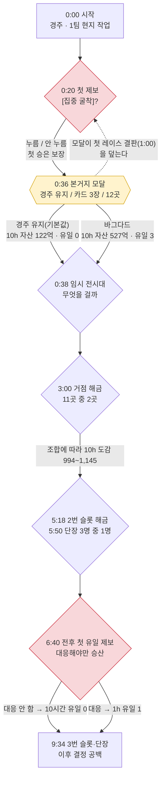
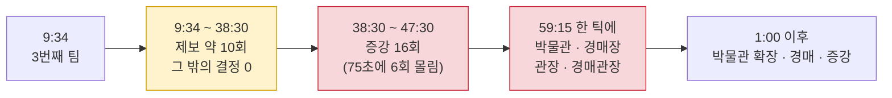

# 첫 10시간 의사 결정 트리 — 첫 10분·첫 1시간 중심

- 일자: 2026-09-24 · 대상: main `45ea111`(v0.6.5)
- 앞선 문서: `notes/completeness-review.md`(2판) · `notes/play-first-10h-v06.md` · `eval.md` §27~§31
- 표기: **[실측]** 이 레포에서 직접 돌린 값 · **[코드]** 소스로 확인 · **[추론]** · **[추정]**

이 문서의 질문은 하나다. **첫 10시간 동안 플레이어 앞에 어떤 선택이 언제 놓이고, 그 선택이
실제로 결과를 바꾸는가.** 선택마다 대안을 직접 돌려 결과 차이를 쟀다(§5). 선택이 화면에 뜨는
것과 그 선택이 결과를 바꾸는 것은 다른 명제이기 때문이다.

---

## 0. 결론

**첫 1시간에 결과를 가장 크게 바꾸는 선택 세 개가 모두 제대로 된 결정이 아니다.**

1. **본거지 선택은 무게가 가장 큰데 눈을 가리고 고른다.** 36초에 뜨는 모달에서 무엇을 고르느냐에
   따라 방치 10시간 자산이 **4.3배**, 유일 획득이 **0점 대 3점**으로 갈린다 **[실측]**. 그런데 카드에는
   "유물이 자주 나온다" 같은 결과문만 있다. 그리고 **기본값(경주 유지)이 가장 나쁜 선택이다.**
   경주는 12거점 중 종 수가 가장 적어(126종) 직접 발굴이 일찍 바닥난다 **[코드·실측]**.
2. **[집중 굴착]은 지배 전략이면서 함정이다.** 원정당 한 번만 누르면 운영 플레이의 1시간 자산이
   **5.3배**가 된다 **[실측]**. 누를지 말지 고민할 이유가 없다. 그런데 뜰 때마다 누르면 원정비
   배수가 2ⁿ으로 곱해져 방치 10시간 자금이 **−$1.47조**가 된다 **[실측]**. 성실한 플레이어가
   파산한다(§6 버그 1).
3. **자동 매각 기준은 숨은 결정이고, 기본값이 지배당한다.** 설정에서 끄면 방치 10시간 자산이
   3.3배, 자금도 2.4배, 유일 2점 대 0점이다 **[실측]**. 모든 축에서 끈 쪽이 낫다. 핵심 딜레마
   ("팔면 강해지고 순위는 떨어진다")가 이 수치에서는 성립하지 않는다.

**시간 배치도 어긋나 있다.** 첫 10분에는 결정 일곱 종이 6분 안에 몰리고, 그중 둘은 같은 순간에
겹친다(본거지 모달이 첫 제보 레이스를 덮는다). 반대로 **9분 34초부터 38분 30초까지는 제보 말고
결정이 하나도 없다.** 그 뒤 75초 동안 증강 6회가 몰리고, 59분 15초에는 박물관·경매장·관장
둘이 한 틱에 전부 열린다 **[실측]**.

**개선의 방향**은 결정을 늘리는 것이 아니다. **무거운 결정은 보이게, 지배 전략은 자동으로,
시간은 90초에 한 번꼴로 고르게** 두는 것이다. §6에 10분·1시간 구간별 처방 여덟 개와 목표
타임라인을 적었다.

---

## 1. 판정 기준

결정이 되려면 네 조건이 필요하다. **정보**(결과를 짐작할 근거가 화면에 있다), **대안**(어느
쪽도 항상 이기지 않는다), **무게**(고른 것에 따라 결과가 실제로 달라진다), **기본값**(안 골라도
게임이 굴러간다, 척추 4번)이다. 이 조건에 따라 선택지를 여섯 등급으로 나눴다.

| 등급 | 뜻 | 처방 |
| --- | --- | --- |
| **결정** | 네 조건을 다 갖췄다 | 지킨다 |
| **눈먼 결정** | 무게는 큰데 정보가 없다 | 정보를 준다 |
| **지배 전략** | 한쪽이 항상 이긴다 | 자동화하거나 대가를 붙인다 |
| **잡무** | 판단 없이 누르기만 한다 | 자동화한다 |
| **함정** | 성실하게 누르면 손해를 본다 | 고친다 |
| **죽은 선택** | 기능은 있는데 뜨지 않는다 | 살리거나 지운다 |

무게는 §5의 변형 실험으로 쟀다. 한 가지만 바꾼 정책을 3시드로 돌려 중앙값을 비교했다.

---

## 2. 트리 — 첫 10분



| 시각 | 노드 | 선택지 | 기본값 | 등급 | 근거 |
| --- | --- | --- | --- | --- | --- |
| 0:20 | 첫 제보 | [집중 굴착] 누름/안 누름 | 28% 자동 추격 | 지배 전략(첫 판은 보장 승) | `TIP_FIRST_WIN_GUARANTEED` **[코드]** |
| 0:36 | **본거지** | 유지 / 추천 3 / 전체 12 | 경주 유지 | **눈먼 결정 + 최악 기본값** | §5.1 |
| 0:38 | 임시 전시 | 어떤 유물을 걸까 | 안 건다 | 결정(무게 미측정) | 명성 축에만 작용 **[추정]** |
| 3:00 | 거점 해금 ×2 | 11곳 중 2곳 | 안 연다 | 결정(무게 작음) | §5.3 |
| 4:26 | 시설 | 보관소 등 | 자동 관리 | 자동 | v0.6.3 자동 대응 **[코드]** |
| 5:18 | 슬롯 해금 | 산다/안 산다 | 안 산다 | 지배 전략 | 정책이 살 수 있으면 즉시 산다 **[실측]** |
| 5:50 | 단장 고용 | 후보 3명 | 안 뽑는다 | 결정(무게 작음, 미측정) | 급여가 판매액의 3.0~4.8%로 스탯에 비례한다(`staff.ts` `foremanSalary`) **[코드]** |
| ~6:49 | **첫 유일 제보** | 대응/무시 | 무시 = 놓침 | 지배 전략 | `TIP_UNIQUE_REQUIRES_RESPONSE` **[코드]**, §5.2 |
| 상시 | 인부·장비·감정소 | 산다 | **자동 재투자** | 자동(끄면 함정) | §5.4 |
| 상시(설정) | 자동 매각 기준 | 희귀 이하 / 끔 등 | 희귀 이하 매각 | **숨은 결정 + 지배당한 기본값** | §5.5 |

**본거지 모달이 첫 레이스를 덮는다.** 모달은 첫 감정 순간(엔진 약 36초)에 열린다
(`ui/useGame.ts`의 `setOnboardingPending(true)`) **[코드]**. 첫 제보는 20초에 떠서 반응 유예 30초가
끝나는 50초 이후에 결판난다. 그러니 "첫 제보는 배우는 자리 — 참가하면 확보한다"가 가르치려는
순간에 화면 중앙은 본거지 모달이다. 85초 캡처에서 모달 뒤 배너가 이미 "확보"로 끝나 있다
(`assets/review/v065-fresh-175s-base.png`와 같은 세션의 85초 캡처) **[실측]**.

**추천 카드는 누구에게나 같다.** 카드 셋은 거점 상수(드랍 배율·층 비용·인구)로만 정렬된다
(`OnboardingOverlay.tsx:24`) **[코드]**. 그래서 모든 플레이어가 이스탄불·델리·바그다드를 본다.
플레이 상태를 반영하지 않으니, 실제로는 "추천을 믿을까"라는 한 가지 질문이다.

---

## 3. 트리 — 10분~1시간



운영 플레이 기준 첫 1시간의 사람 조작 시각이다(`playlog --json`, 기본 시드) **[실측]**.

| 종류 | 시각 |
| --- | --- |
| 단장 고용 | 0:00 · 5:50 · 9:34 · 38:30 |
| 슬롯 해금 | 5:18 · 9:34 · 38:30 |
| 거점 해금 | 3:00 · 4:26 |
| 발굴단 증강 | 38:30 · 38:45 · 39:00 · 39:15 · 39:30 · 39:45 · 44:00 … 56:45 (16회) |
| 박물관·경매장·관장·경매관장 | 59:15 (4건 동시) |
| 제보 | 약 3분 간격 19회 · 승 15 · 패 4 |

**29분 동안 결정이 제보뿐이다.** 제보는 3분마다 오니 사건은 있다. 하지만 그 사이 플레이어가
고를 것은 [집중 굴착] 하나이고, 그마저 §5.2에서 보듯 지배 전략이다. 그 뒤로는 반대로 몰린다.
증강은 "살 수 있으면 산다"라 결정이 아니다. 박물관과 경매장은 한 틱에 같이 열려서, 각각이
주는 첫 경험(첫 관람객, 첫 낙찰)이 한 번에 뭉개진다 **[추론]**.

---

## 4. 1~10시간 (요약)

1시간 이후의 트리는 가지가 거의 없다. 사람 조작은 증강(10시간 누적 85회), 박물관 확장 16회,
전시 15회가 대부분이다 **[실측]**. 새 결정 종류는 경매장 확장(2.5시간) 정도다. 이 구간의 문제는
2판 §3.3에서 다뤘으니 여기서는 되풀이하지 않는다. 한 가지만 더한다. **방치 플레이는 10시간
동안 유일을 한 점도 얻지 못한다**(3시드 중앙값 0) **[실측]**. 첫 유일부터 대응이 필요하도록
설계됐기 때문이다(`TIP_UNIQUE_REQUIRES_RESPONSE`). 그래서 재미 정의 ①은 첫 유일 제보를
플레이어가 알아채느냐에 달려 있다.

---

## 5. 결정의 무게 — 대안을 직접 돌려 본 값

3시드(`20260917 · 20268836 · 20276755`) 중앙값이다. 자산 단위는 백만 달러다. 10분 값은 T3 한
점의 행운에 크게 흔들리므로 방향만 본다.

### 5.1 본거지 — 방치 플레이, 36초에 이전

| 선택 | 1h 도감 | 1h 자산 | 10h 도감 | 10h 자산 | 10h 유일 | 10h 레이스 |
| --- | ---: | ---: | ---: | ---: | ---: | --- |
| **경주 유지(기본값)** | 158 | 2,505 | 478 | **12,232** | **0** | 133승 40패 |
| 이스탄불(추천 1) | 184 | 6,009 | 651 | 33,053 | 1 | 175승 13패 |
| 델리(추천 2) | 122 | 2,385 | 477 | 31,488 | 1 | 178승 8패 |
| 바그다드(추천 3) | 184 | 18,217 | 688 | **52,705** | **3** | 165승 22패 |
| 교토 | 151 | 3,510 | 464 | 12,898 | 0 | 175승 10패 |
| 쿠스코 | 113 | 3,597 | 375 | 30,576 | 1 | 175승 11패 |

운영 플레이에서도 델리로 옮기면 10시간 도감이 1,000에서 1,277종이 된다 **[실측]**. 경주가
불리한 이유는 [추론]이다. 경주는 종 수가 126종으로 가장 적어(다른 거점은 140~177종) 직접
발굴의 새 종이 일찍 바닥난다. 방치 5시간 도감 캡처에서 경주가 124/126종으로 이미
포화돼 있다(`assets/review/v065-idle-5h-codex.png`) **[실측]**. 레이스 패배도 경주가 40패로
가장 많다. 경주 홈 라이벌이 둘(이무진·박준서)이기 때문으로 보인다 **[추정]**.

### 5.2 제보 대응 — [집중 굴착]·[급파]

| 정책 | 1h 자산 | 1h 유일 | 1h 자금 | 10h 도감 | 10h 자산 | 10h 자금 |
| --- | ---: | ---: | ---: | ---: | ---: | ---: |
| 운영, 안 누름 | 2,757 | 0 | 1 | 1,000 | 68,199 | 407 |
| 운영, **원정당 1회** | **14,702** | **1** | 3 | 1,000 | 85,757 | 280 |
| 운영, **뜰 때마다** | 15,002 | 1 | **−1,521** | **315** | 85,527 | **−3,836,751** |
| 방치, 안 누름 | 2,505 | 0 | 4 | 478 | 12,232 | 161 |
| 방치, 원정당 1회 | 1,932 | 0 | 19 | 477 | 41,800 | 340 |
| 방치, 뜰 때마다 | 15,339 | 1 | −14 | **337** | 38,495 | **−1,475,504** |

원정당 한 번 누르는 것은 모든 축에서 낫거나 같다. 대가(원정비 2배)가 이득보다 훨씬 작아
**지배 전략**이다. 뜰 때마다 누르면 원정비 배수가 곱해져 자금이 음수로 무너지고, 감정비를
못 내 도감이 멈춘다(운영 1,000 → 315종). 원인은 §6 버그 1이다. [급파]는 10시간 동안 한 번도
조건을 만족하지 못했다(2판 §3.1) **[실측]**.

### 5.3 거점 해금 조합 — 운영 플레이, 3분부터

| 조합 | 1h 자산 | 10h 도감 | 10h 자산 |
| --- | ---: | ---: | ---: |
| 그리스·이집트(정책 기본) | 2,757 | 1,004 | 74,344 |
| 교토·시안(가까운 곳) | 2,987 | 994 | 56,225 |
| 델리·바그다드 | 3,827 | 1,111 | 58,897 |
| 로마·쿠스코 | 2,987 | 1,145 | 59,636 |

도감은 ±7%, 자산은 ±15% 안이다. **무게가 작은 결정**이다. 나쁜 것은 아니다. 가벼운 결정이
처음에 오고 무거운 결정이 나중에 오는 게 정상인데, 지금은 순서가 반대다(본거지 36초, 해금 3분).

### 5.4 자동 재투자 끄기 — 방치

10시간 자산 84 대 12,232다 **[실측]**. 끄면 게임이 멈춘다. 코드 주석은 "꺼도 손실은 없다"(`engine.ts:1851`)라고 적고,
설정 화면은 "남는 자금을 인부·장비·감정소에 자동으로 쓴다"뿐이라 끄면 무엇을 잃는지 말하지 않는다
**[코드]**. 이 스위치는 선택이 아니라 사실상 고정값이다.

### 5.5 자동 매각 끄기 — 방치

| 설정 | 1h 자산 | 10h 도감 | 10h 자산 | 10h 자금 | 10h 유일 | 10h 순위 |
| --- | ---: | ---: | ---: | ---: | ---: | ---: |
| 희귀 이하 매각(기본값) | 2,505 | 478 | 12,232 | 161 | 0 | 2 |
| 끔 | 2,805 | 466 | **40,032** | **387** | **2** | **1** |

끈 쪽이 자산·자금·유일·순위에서 모두 앞선다. 도감만 12종 뒤진다. **메커니즘은 확인하지
못했다.** 끄더라도 v0.6.4의 중복분 배치 정리(20점)가 나중에 팔기 때문에 "안 판다"가 아니라
"나중에 몰아서 판다"가 된다. 그 차이가 왜 자금까지 늘리는지는 이 측정으로 말할 수 없다.
시드를 늘려 재확인하기 전까지는 [실측, 3시드]로만 읽는다.

---

## 6. 개선안

### 먼저 고칠 버그

1. **[집중 굴착] 원정비 배수의 누적.** `focusDig()`는 누를 때마다 `team.costMult`에 2를
   곱하고(`engine.ts:1458`), 이 값은 귀환 정산 때만 1로 돌아간다(`engine.ts:1532`) **[코드]**.
   한 원정 동안 제보가 n번 오면 원정비가 2ⁿ배가 된다. 방치 플레이는 10시간에 원정이 세 번뿐이라
   한 원정이 몇 시간씩 이어진다. 배수를 곱하지 말고 **원정당 한 번(최대 ×2)**으로 묶거나,
   그 제보가 열려 있던 구간의 비용에만 붙인다. 급파(`engine.ts:1441`, ×3)도 같은 구조다.
2. **자금 음수 하한 없음.** −$1.47조까지 내려간다. 원정비 정산에 하한(예: 보유 자금까지만)이
   필요하다. G56이 같은 종류의 결함(−80억)을 한 번 고쳤던 경로다.

### 첫 10분 — 무거운 결정을 보이게, 겹친 결정을 풀어서

**P1. 본거지 결정을 3분 거점 해금과 합친다.** 지금은 36초에 무거운 결정(본거지)이 눈을 가린
채 오고, 3분에 가벼운 결정(해금)이 따로 온다. 모달을 없애고, 3분의 첫 해금 순간에 카드 세 장을
보여 준다. 카드에는 결과를 가르는 숫자를 쓴다. **종 수(126 대 177), 그 거점의 유일 1종과 층,
홈 라이벌 수**다. 모두 이미 데이터에 있다. 그리고 **기본값을 최악이 아니게** 한다. 경주의 종
수를 늘리는 것은 척추 1번(현존 수량 = 공급)과 부딪치므로, 대신 첫 해금 전까지 경주의 한계
("126종 — 다른 거점의 70%")를 화면에 적어 둔다.
- 효과: 가장 무거운 결정에 정보가 붙고, 첫 레이스와 겹치지 않는다. 결정 수는 하나 준다.
- 비용: M(모달 제거, 해금 카드 UI, `play`의 `first` 시나리오 수정).
- 부작용: v0.2부터 이어진 "본거지를 정하자" 온보딩이 사라진다. 첫 감정 직후의 온보딩 순간이
  비므로, 그 자리는 §5.3의 "첫 제보는 배우는 자리" 연출에 넘긴다.
- 확인: §5.1 실험을 3분 선택 기준으로 다시 돌려 기본값과 최선의 격차가 줄었는지 본다.

**P2. [집중 굴착]을 지배 전략에서 결정으로 만든다.** 버그 1을 고친 뒤에도 원정당 1회 누르는
것은 5배 이득이다. 선택지 하나를 늘 누르게 되면 결정이 아니다. 둘 중 하나를 고른다.
- (가) **자동화하고 유일에만 버튼을 남긴다.** 진귀·국보 제보는 현지 팀이 알아서 집중하고,
  유일만 사람이 누른다. 결정이 한 번의 무거운 순간으로 모인다.
- (나) **대가를 자금으로 바꾸고 금액을 적는다.** "집중 굴착 — $12만(현재 자금의 8%)". 이러면
  팔면 강해지고 순위가 떨어진다는 핵심 딜레마가 레이스에 걸린다(1판 권고).
- 권고는 (가)다. 첫 10분에 선택지가 이미 많고, 3분마다 오는 버튼은 곧 반사가 된다 **[추정]**.

**P3. 첫 10분의 결정을 한 번에 하나씩 둔다.** 지금은 0:20~5:50에 일곱 종이 몰린다. 목표
타임라인은 이렇다.

| 시각 | 한 가지 결정 | 비고 |
| --- | --- | --- |
| 0:20 | 첫 제보 — 참가만 해도 확보 | 배우는 자리. 모달 없음 |
| 1:30 | 첫 전시 — 방금 얻은 진귀를 걸까 | 결과(명성)를 바로 보여 준다 |
| 3:00 | **거점 선택**(P1) — 숫자가 적힌 카드 세 장 | 가장 무거운 결정 |
| 5:00 | 둘째 팀 — 단장 3명 중 1명 | 스탯과 급여를 대비 |
| 6:50 | **첫 유일 제보** — 대응해야 산다 | 소리·화면 전체 알림(P4) |
| 9:00 | 셋째 슬롯 | 사도 되고 안 사도 되는 가격대로 |

**P4. 첫 유일 제보를 놓칠 수 없게 한다.** 방치 10시간 유일 0점의 원인이 이 한 번이다. 지금은
배너가 평소 제보와 같은 자리, 같은 크기로 뜬다. 첫 유일만큼은 화면 전체 알림과 소리(Web Audio
합성)로 띄운다. 비용 S. 규칙(대응해야 산다)은 그대로 두고, 알아챌 기회만 준다.

### 첫 1시간 — 공백을 채우고, 몰린 것을 푼다

**P5. 발굴단 증강을 자동화한다**(2판 §5.1). 38:30~47:30의 16회, 특히 75초에 6회 몰리는 구간이
사라진다. 비용 S~M.

**P6. 박물관과 경매장을 떼어 놓고, 9:34~38:30의 공백에 넣는다.** 지금은 둘이 59:15에 한 틱에
열린다. 이 둘을 29분짜리 공백으로 당겨 **각자의 순간**을 준다. 박물관은 첫 국보가 들어온 직후가
자연스럽다(첫 국보는 v0.6.1 기준 21~37분, `eval.md` §28.5·§28.6). "이걸 걸 자리가 필요하다"가 동기가 된다. 경매장은 소장고 중복이
처음 20점을 넘는 순간(v0.6.4의 배치 문턱)이 맞다. "팔 곳이 필요하다"가 동기다. 건립비를 낮추는
대신 **첫 건립 비용을 그 순간의 자금 수준에 맞춘다.** 세계 재고나 평가액은 건드리지 않는다.
- 효과: 1시간 안의 결정이 한 곳에 몰리지 않고 약 5~10분 간격으로 흩어진다 **[추정]**.
- 부작용: 박물관·경매장 수입이 앞당겨져 엔딩(16시간)이 조금 빨라질 수 있다. v0.5.3 이후
  박물관은 거의 돈을 벌지 않으므로(관람료 $30) 영향은 경매장 쪽이 크다 **[추정]**. `sim --hours 48`로 확인한다.

**P7. 자동 매각 기본값을 다시 잰다.** §5.5가 맞다면 기본값이 모든 축에서 진다. 먼저 12시드로
재확인하고, 맞으면 (가) 기본값을 "감정 즉시 매각 끔 + 중복 배치 정리"로 바꾸거나 (나) 감정 즉시
매각에 실제 이점(예: 자금 즉시 확보로 제보 대응 비용을 낸다, P2-나와 연결)을 준다. 지금 상태로는
설정 화면의 이 선택지가 초보자를 손해 보는 쪽에 묶어 둔다.

**P8. 결정 계측을 버튼 기준으로 고친다**(2판 §5.4). `density`의 B축이 버튼 없는 제보를 결정으로
센다. 위 P1~P7의 효과를 재려면 자부터 맞아야 한다. 이 문서의 기준으로는 지배 전략과 잡무도
결정 수에서 빼야 한다. 제안하는 새 지표는 **"첫 10분·1시간의 결정 수(등급 '결정'만)"**와
**"결정 간 최장 간격"**이다. 목표는 첫 10분 결정 5회 이상, 첫 1시간 최장 간격 10분 이하다 **[추정]**.

### 우선순위

버그 1·2 → P4(S, 유일 0점 해소) → P8(S, 자) → P1·P3(M, 첫 10분 재배치) → P5·P6(첫 1시간) →
P2·P7(설계 판단 필요) 순을 권한다. P1은 무게가 가장 큰 결정이라 효과가 가장 크지만, P8의 자가
먼저 있어야 전후를 잴 수 있다.

---

## 7. 재현

```bash
pnpm --filter relic-king playlog -- --hours 10 --json out.json   # §3 시각표
```

§5의 변형 실험은 `app/src/sim/`에 임시 파일로 두고 `npx tsx`로 돌렸고, 커밋하지 않았다. 핵심은
`playlog`와 같은 두 정책 루프에 변형 하나씩을 얹는 것이다.

```ts
// 변형: base(36초에 relocateBase) · focus(뜰 때마다) · focusOnce(원정당 1회) ·
//       reinvest=false · autoSell=null · unlockOrder(정책의 거점 해금 순서 대체)
const w = createWorld(seed); const rec = createPersistentRecord();
while (w.t < 36000) {
  const st = w.t < 1200 ? STEP_EARLY : STEP_LATE;
  if (policy === "active") { liquidateSurplus(w); runAutoRoutine(w); actExpansion(w); }
  else if ((acc += st) >= 60) { acc = 0; runAutoRoutine(w); }
  if (v.base && !based && w.stats.drops > 0 && w.t >= 36) { relocateBase(w, v.base); based = true; }
  if (v.focusOnce && w.tip && !w.tip.resolved && !w.tip.focused) {
    const on = w.teams.find((t) => t.status === "on_site" && t.targetSite === w.tip!.site);
    if (on && (on.costMult ?? 1) === 1) focusDig(w, on.id);
  }
  advance(w, st, false, st, rec);
  // 600 · 3600 · 36000초에 codexProgress·playerAssets·w.funds·유일 소유·fullRanking 순위를 찍는다
}
```

`unlockOrder` 변형은 `actExpansion()`의 거점 해금 루프만 지정 순서로 바꾸고, 나머지(팀·증강·시설)는
그대로 두었다.

## 8. 한계

- **3시드다.** 10분 값은 T3 한 점에 좌우되고, 10시간 자산은 유일 한 점에 좌우된다. 방향은
  믿을 만하지만 배수(4.3배, 5.3배)는 흔들린다. 특히 §5.5는 메커니즘을 확인하지 못했다.
- **정책은 사람이 아니다.** "원정당 1회"도 기계적이다. 사람은 더 늦게, 더 불규칙하게 누른다.
- **임시 전시와 단장 선택의 무게는 재지 않았다.** 등급은 코드 근거의 [추론·추정]이다.
- UI 시각(모달 36초, 첫 레이스 결판 약 1분)은 엔진 시각이다. 실제 화면은 렌더 지연으로 몇 초
  늦을 수 있다.
