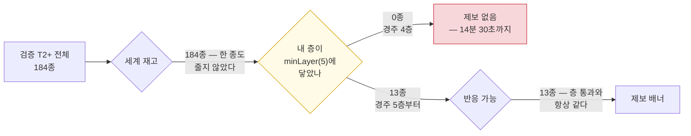
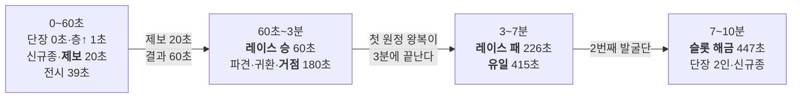
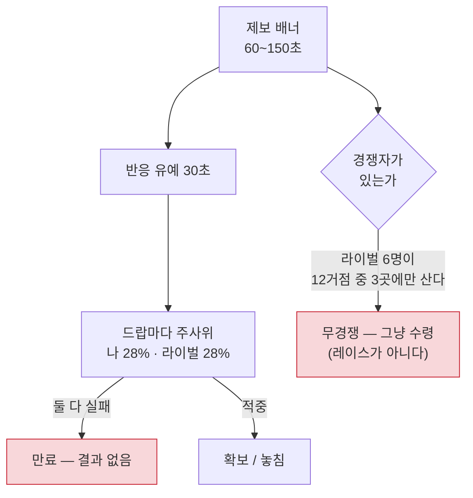

# 첫 60초·첫 10분의 경험 지도 — v0.6 밀도 패스

- 일자: 2026-09-21 (v0.6)
- 수집: `pnpm --filter relic-king density -- --seeds 5 --tail-minutes 60`
- 앞선 지도: `notes/play-first-10h.md`(v0.3.4, **10분 해상도**). 이 문서는 같은
  구간을 **5초·30초 해상도**로 다시 본다.
- 전후 원장 표와 부작용은 `eval.md` §27.

v0.3.4의 지도는 "첫 10시간 중 살아 있는 구간은 앞의 3시간 30분"이라고 적었다.
v0.6의 질문은 한 칸 더 안쪽이다 — **그 살아 있다는 3시간 30분의 맨 앞 1분에는
무엇이 있는가.** 답은 한 종류였다.

---

## 0. 결론

**첫 1분에 일어나는 의미 있는 사건이 3종에서 6종으로, 첫 10분이 4종에서 12종으로
늘었다.** 제보는 14분 30초에서 **20초**로, 첫 레이스 결과는 15분에서 **1분 16초**로,
첫 유일(T4) 조우는 "60분 안에 도달 못 함"에서 **6분 49초**로 앞당겨졌다. 반복 대
의미는 7.14 : 1에서 **1.38 : 1**이 됐다.

그 대가로 **엔딩이 140시간 36분에서 16시간 25분이 됐다**(8.6배 압축). 이건 손해로
적지 않는다 — 작업 지시 §3이 허용한 대가이고, 실제로 첫 10분에 도달하는 콘텐츠
몫이 0.12%에서 1.0%로 올라간 직접적인 이유다.

**진단이 앞선 문서의 추정을 뒤집었다.** v0.3.4의 §5.2는 제보가 마르는 원인을
"반응 가능한 거점이 하나뿐"으로 짚었고, 작업 지시 §1은 첫 제보 936초의 원인을
"`spawnTip`의 풀이 비어 30초 재시도를 반복하기 때문으로 **보인다**"고 적었다.
필터를 단계별로 세어 보니 **둘 다 초반에는 원인이 아니었다.**

---

## 1. 첫 제보 14분 30초의 진짜 원인 — 층 필터

`spawnTip`의 풀은 네 단계를 통과해야 한다. 5초 간격으로 단계별 개수를 세면
(`density`의 제보 풀 진단, 엔진의 `tipPoolStages`가 `spawnTip`과 **같은 코드**를
탄다) v0.5.1은 이렇게 나온다.

```
시각        전체   재고   층통과   반응가능 │ 내 거점·층
       5초    184    184        0          0 │ kor1
    1분 0초    184    184        0          0 │ kor1
   10분 0초    184    184        0          0 │ kor4
   30분 0초    184    184       13         13 │ kor6
```

**재고는 한 종도 줄지 않았고(184 → 184), 반응 가능은 층 통과와 항상 같다.**
0이 되는 자리는 오직 **층 통과**다.

이유는 상수 두 개가 만나는 지점에 있다. 제보 대상은 진귀(T2) 이상인데
(`spawnTip`의 `a.tier < 2` 필터), `TIER_MIN_LAYER[2] = 5`다. 즉 **경주 5층에
닿기 전에는 제보 풀이 구조적으로 0**이고, 그때까지 `TIP_FIRST_DELAY`(90초)도
재시도 간격(30초)도 아무 의미가 없다. v0.5.1이 5층에 닿는 시각이 14~15분이었고,
**그게 그대로 첫 제보 시각이었다.**



그래서 v0.6의 첫 처방은 제보 상수가 아니라 **깊이 곡선**이다. 5층을 15초에
열면 제보는 저절로 20초에 뜬다. 실제로 그렇게 됐다.

> **앞선 진단이 틀린 건 아니다.** `notes/play-first-10h.md` §5.2가 재고·반응
> 가능을 지목한 것은 **3시간 30분 이후**의 이야기이고, 그 구간에서는 지금도
> 맞다(4시간에 반응 가능이 0이 된다). 두 문서는 **다른 구간**을 보고 있다 —
> 첫 10분의 병목과 4시간째의 병목이 서로 다른 단계라는 게 이번 계측의 소득이다.

---

## 2. 깊이가 페이싱 척추라는 말을 숫자로

`notes/mda.md` §6의 시간 스케일 표는 **"세션(10~20m): 층 돌파 → 발굴지 해금 →
제보 대응 → 순위 확인"**이라고 적어 뒀다. 그런데 v0.5.1의 실측은 12층 도달이
**4시간 39분**이었다. 게임이 자기 설계 문서와 14배 어긋나 있었다.

| | v0.5.1 | v0.6 | 설계 문서(`mda.md` §6) |
| --- | ---: | ---: | --- |
| `layerCost` | `300 × 2.45^(L-1)` | `6 × 2.08^(L-1)` | — |
| 5층 도달(진귀·제보 해금) | 14분 30초 | **15초** | — |
| 첫 국보(T3) 획득 | 38분 45초 | **5분 4초** | — |
| 12층 도달 | 4시간 39분 | **9분 2초** | 10~20분 |
| 첫 유일(T4) 획득 | 2시간 11분 | **13분 36초** | — |

(층 도달은 `density`의 제보 풀 진단, 나머지는 `pnpm sim -- --hours 48`.)

v0.6은 문서가 원래 적어 둔 스케일로 되돌린 것이지 새 스케일을 발명한 게 아니다.

---

## 3. 깊이를 당기면 드랍이 말라붙는다 — 그래서 천장을 만들었다

깊이 압축만 넣고 재 보니 **첫 레이스 결과가 오히려 8분으로 밀렸다.** 원인은
척추 2번이 제대로 작동한 결과였다.

드랍 임계는 층 기대 평가액에 비례한다(`dropThreshold`). 진귀(900만₩)·국보
(2.6억₩)가 열리는 순간 층 기대가치가 8~20배로 뛰므로, **발굴력이 따라오기 전에
깊은 층에 서면 드랍 간격이 100초**가 된다. 제보 배너(60~150초) 안에 드랍이
한두 번밖에 안 오면 레이스는 결판이 안 난다.

`notes/mda.md` §6은 이 상태를 이미 **경보 기준**으로 적어 뒀다 — "초기 구간 드랍
간격은 40초를 넘기지 않는다". v0.6은 그 경보를 **규칙으로** 만들었다
(`DROP_INTERVAL_CEILING_SECONDS = 20`). 하한과 대칭이다.

| 구간 | 무엇이 고정되나 | 무엇이 변하나 |
| --- | --- | --- |
| 하한(16초)에 붙음 | 드랍 **빈도** | 발굴력을 더 올려도 드랍은 그대로, 층만 빨리 내려간다 |
| 층 기대가치에 묶임 | — | 척추 2번의 정상 구간. 수입 ∝ 발굴력 |
| 천장(20초)에 걸림 | 드랍 **빈도** | 깊이를 따라 **한 건의 값**이 커진다 |

천장이 걸린 구간에서는 드랍이 줄고 한 건이 무거워진다 — 작업 지시 §2의 D축이
허용한 "분모를 줄여도 된다"가 이 형태로 구현됐다. 두 벽 모두 `📋 규칙` 화면에
그대로 적었다(척추 5번).

**부작용 하나를 같이 고쳤다.** 원정비는 "이 원정의 기대 수입" 노셔널 공식으로
사이징하는데(G56), 천장이 걸리면 그 수입률이 발굴력과 무관하게 `층 기대가치 ÷
천장`이 되어 **약한 팀이 깊은 층에 서면 원정비가 10배로 뛴다.** 실측에서 팀
하나가 왕복 한 번에 1,470만₩을 청구당해 자금이 −1,451만₩까지 떨어졌고 그 동안
감정 파이프라인이 통째로 멈췄다(`qa:pipeline` 정지 562초). 노셔널 계산에는
**천장을 빼고 하한만** 반영하도록 분리했다(`notionalDropThreshold`) — 천장은
페이싱 장치이지 수입 장치가 아니다.

---

## 4. 첫 60초 — 5초 격자로 나란히

같은 시드(20276755), 운영 플레이.

| 구간 | v0.5.1 | v0.6 |
| --- | --- | --- |
| 0~5초 | 단장 | **단장 · 층↑** |
| 5~10초 | 신규종 | 층↑ |
| 10~15초 | — | 층↑ |
| 15~20초 | 신규종 | **신규종 · 제보** ← 긴장 1회·결정 1회 |
| 20~30초 | 신규종 · 전시 | — (반응 유예 30초) |
| 30~35초 | — | 층↑ |
| 35~40초 | 신규종 | **전시 · 신규종** ← 결정 1회 |
| 40~55초 | 신규종 | — |
| 55~60초 | 신규종 | **신규종 · 레이스 승** ← 긴장 1회 |
| **그 1분의 사건 종류** | **3종** | **6종** |

v0.5.1의 첫 1분은 `신규종`이 다섯 번 반복된다. v0.6의 첫 1분에는 **층 돌파 ·
제보 · 전시 · 레이스 · 신규종 · 단장 합류**가 한 번씩 있고, 그 사이에 **아무
일도 안 일어나는 5초 칸이 여섯 개** 있다 — 조용한 칸이 생긴 것도 개선이다.
v0.5.1은 조용한 칸이 없는 대신 시끄러운 칸이 전부 같은 사건이었다.

---

## 5. 첫 10분 — 무엇이 새로 들어왔나

seed 20276755 기준, 첫 10분에 겪는 사건 종류:

- **v0.5.1 (4종)**: 단장 · 신규종 · 전시 · 층↑
- **v0.6 (12종)**: 단장 · 층↑ · 신규종 · 제보 · 전시 · **승** · 파견 · 귀환 ·
  **거점** · **패** · **유일** · **슬롯**

이 시드의 최초 시각(초): 단장 0 · 층↑ 1 · 신규종 20 · **제보 20** · 전시 39 ·
**승 60** · 파견/귀환/거점 180 · **패 226** · **유일 415** · 슬롯 447.

작업 지시 §6.2가 요구한 "얻음과 잃음이 모두"는 **승(1분 0초)과 패(3분 46초)**로
채워졌다. 유일(T4)은 **6분 55초**(5시드 중앙 6분 49초)에 조우한다 — 공급을
늘려서가 아니라 레이스를 앞당겨서다(협상 불가 2번).



---

## 6. 결정(B축)은 새 시스템이 아니다

작업 지시 §2 B가 요구한 "기회비용이 있거나 되돌릴 수 없는 선택"을 **이미 화면에
있는 자리**로만 세었다. 강제가 아니다 — 안 누르면 기본값이 대신 고르고 게임은
계속 돈다(척추 4번).

| 종류 | 화면 | 기회비용 | 안 누르면 |
| --- | --- | --- | --- |
| `base` | "본거지를 정하자" 오버레이 | 무료 창 12시간 안에서만 무료 | 경주 유지 |
| `tip` | 제보 배너 `[집중 굴착]`·`[급파]` | 원정비 2~3배 | 28% 자동 추격 |
| `dispatch` | 원정 목적지 선택 | 그 회차 동안 다른 거점 포기 | 루틴이 추천 1위로 |
| `unlock` | 세계 지도 거점 해금 | base 슬롯 상한·이전 비용 | 안 연다 |
| `keep` | 소장고 T3+ 입고 | 성장↔점수 맞교환 | 자동매각 규칙대로 |

첫 10분 실측(5시드): **5~6회** — 제보 3~4 · 본거지 1 · 목적지 1 · (보유/매각 0~1).
v0.5.1은 **1회**(본거지)뿐이었다. seed 20276755의 실제 내역:
`제보 20초 · 본거지 39초 · 제보 179초 · 목적지 180초(일본) · 제보 372초 ·
보유/매각 436초(투탕카멘 황금 마스크 T4)`.

**제보가 결정이 된 것은 상수 하나 덕이다.** 라이벌 적중률을 플레이어와 같은
28%로 올려(`TIP_RIVAL_HIT` 0.10 → 0.28), 아무것도 안 누르면 **반반**이고
`[집중 굴착]`을 누르면 60%가 된다. v0.5.1에서는 168시간 전체로 승 545 / 패 42라
"잃을 수도 있다"가 통계적으로만 존재했고 **첫 10분의 패는 5시드 전부 0회**였다.

---

## 7. 반응 유예 — 15초짜리 창을 없앤 방법

`notes/play-telemetry.md` §4가 "초반 제보 창 중앙 15초(설계 60~150초)"로 남겨 둔
결함이다. 원인은 그 문서가 이미 짚었다 — **레이스가 먼저 끝나면서 배너도 같이
닫힌다**(드랍 8초 × 적중 28%면 평균 2~3드랍에 결판).

v0.6은 승률을 건드리지 않고 창만 늘렸다. `TIP_MIN_RESPONSE_SECONDS = 30` 동안은
**어느 쪽도** 그 유물을 가져가지 못한다(플레이어·라이벌 대칭이라 상대 승률은
그대로다). 결판이 난 뒤에도 배너는 **결과를 보여 주며 수명을 다 채운다** —
§7.3의 두 번째 처방("이긴 사실조차 배너에서 못 본다")이 같이 닫혔다.

| | v0.5.1 | v0.6 |
| --- | ---: | ---: |
| 배너 수명 중앙값(첫 10분) | 제보 자체가 없음 | **102초** (설계 60~150초 안) |
| 최악 시드 | — | 87초 |
| 반응 가능 시간(최소 보장) | 0초 | **30초** |

배너 수명(102초)과 실제로 누를 수 있는 시간(최소 30초)은 다른 숫자다. 둘 다
적는다 — 배너가 길다고 반응 창이 긴 것은 아니기 때문이다.

---

## 8. 방치 플레이도 같이 올라갔다 (§6.4)

탭만 열어 두는 플레이는 A·C·E 목표의 **절반**을 기준으로 본다.

| 축 | 절반 기준 | v0.5.1 | v0.6 | 판정 |
| --- | --- | ---: | ---: | :---: |
| A 사건 종류 1분 | ≥3종 | 2종 | **4종** | ✅ |
| A 사건 종류 10분 | ≥6종 | 3종 | **8종** | ✅ |
| C 긴장 1분 | ≥1회 | 0회 | **1회** | ✅ |
| C 긴장 10분 | ≥2회 | 0회 | **6회** | ✅ |
| E 첫 제보 | ≤120초 | 15분 0초 | **20초** | ✅ |
| E 첫 레이스 결과 | ≤240초 | 15분 15초 | **3분 39초** | ✅ (최악 5분 20초 미달) |
| E 첫 T4 조우 | ≤20분 | 도달 못 함 | **11분 30초** | ✅ |
| E 첫 거점 해금 | ≤20분 | 도달 못 함 | 도달 못 함 | ❌ |

**거점 해금은 방치 플레이에 구조적으로 없다** — 사람이 지도에서 눌러야 열린다.
이건 결함이 아니라 척추 4번의 경계다(클릭 0회로 완주는 하되, 모든 선택을
게임이 대신 하지는 않는다). 10시간 스케일에서 보면 방치 플레이의 도감이
126종 → **470종**으로 올라갔다(`pnpm playlog -- --hours 10 --bucket 10`).

---

## 9. 절벽을 앞으로 옮긴 게 아니다 (§6.3)

압축의 가장 그럴듯한 실패는 "3시간 30분 벽"이 "20분 벽"이 되는 것이다. 목표 창
**직후** 구간(10분~60분)의 최장 무(無)의미 구간을 기준으로 잡았다.

| | v0.5.1 | v0.6 |
| --- | ---: | ---: |
| 운영 — 중앙 | 2분 15초 | **2분 0초** |
| 운영 — 최악 | 2분 45초 | **2분 30초** |
| 방치 — 중앙 | 2분 15초 | **2분 45초** |
| 방치 — 최악 | 4분 30초 | **3분 0초** |

10시간 스케일에서도 확인했다 — 운영 플레이의 **15분 이상 공백이 0.0%**이고
(v0.5.1은 첫 10시간에 3시간 30분 이후가 통째로 비어 있었다), 방치도 10.3%다.
벽은 앞으로 오지 않았다.

---

## 10. 이 측정의 한계

- **시드 5개다.** 중앙값과 최악값을 같이 적었지만 5개는 5개다. `--seeds N`으로
  늘릴 수 있고, 늘리면 최악값은 더 나빠지는 쪽으로 움직일 것이다.
- **두 정책은 사람이 아니라 양 극단이다**(`eval.md` §23.8과 같은 한계). "운영"은
  살 수 있는 것을 즉시 사는 기계다. 국면 경계는 **사람이 겪을 수 있는 가장 빠른
  경계**로 읽어야 한다.
- **첫 10분은 1초 스텝으로 적분한다** — 5초 격자가 스텝 경계에 정확히 떨어지게
  하려는 것이고, 그래서 같은 시드라도 `playlog`(2초 스텝)와 이벤트 순서가 미세하게
  갈릴 수 있다. 스텝 무관성 자체는 `sim`·`qa_expedition`·`qa_economy`가 따로 지킨다.
- **A축의 t=0 사건.** 단장 합류는 `createWorld` 안에서 일어나므로 상태 diff
  계측기가 보지 못한다. `createWorld(seed, false)` → 스냅샷 → `grantStartingTeam`
  순서로 불러 그 두 사건을 보게 했다(`density.ts`). 다만 **세계 생성 직후의 첫
  파견**은 여전히 "새로 꾸려진 팀"이라 `foremanHired` 쪽에서만 세어진다 —
  v0.6에서 `파견`이 첫 10분에 잡히는 것은 3분째의 **재파견**이다.
- **UI 실측은 별개다.** 이 문서의 숫자는 전부 엔진 계측이고, 화면에서 실제로
  그 순간에 무엇이 보이는지는 `pnpm play`가 따로 본다(첫 세션 다섯 마일스톤은
  `brief.md` §첫 세션 실측 표).

---

## 11. 재현

```bash
pnpm --filter relic-king density                              # 기본 5시드·꼬리 60분
pnpm --filter relic-king density -- --seeds 9 --tail-minutes 90
pnpm --filter relic-king density -- --json out.json --no-grid
pnpm --filter relic-king playlog -- --hours 10 --bucket 10    # 10시간 지도(v0.3.4와 같은 명령)
```

`density`는 결정론이다 — 같은 명령을 다시 돌리면 같은 표가 나온다. 시드는
`20260917 + i × 7919`로 생성한다.

---

## 12. 덧붙임(v0.6.1) — 레이스에 결판이 없었다

이 문서의 §5~§7은 v0.6의 첫 10분을 "제보가 20초에 뜨고 1분 16초에 첫 결과가
난다"로 적었다. **5시드 중앙값의 이야기**였다. 12시드로 다시 재면 같은 빌드가
이렇게 갈린다.

| | 5시드 최악 | 12시드 최악 |
| --- | ---: | ---: |
| 첫 레이스 결과 | 7분 30초 | 7분 30초 |
| 첫 10분 승 / 패 | 0회 / 1회 | **0회 / 0회** |
| 첫 T4 조우 | 8분 57초 | **23분 15초** |
| 첫 10분 사건 종류 | 11종 | **10종** |

제보 하나하나를 추적해 보니 원인은 하나였다 — **레이스에 결판이 없다.**



v0.6.1은 이 두 붉은 칸을 닫았다. **마감**(유예 뒤 30초면 그 자리에서 결판난다)이
`만료 — 결과 없음`을, **참가 대칭·세계 전파**(그 거점에 있으면 라이벌도 참가하고,
국보·유일은 아무도 없으면 가장 가까운 수집가가 반응한다)가 `무경쟁 수령`을 없앤다.
거기에 **첫 승 보장**과 **첫 유일 교훈**이 한 쌍으로 붙어, 첫 세션이 "먼저 도달하면
갖는다"와 "유일은 대응해야 한다"를 한 번씩 가르친다.

결과는 12시드에서 14축 전부 통과이고 24·48시드에서도 유지된다. 수치와 되돌린
시도 셋은 `eval.md` §28, 판단 근거는 `notes/decisions.md` G87~G90.

**이 문서가 남긴 교훈 하나**: §10이 "시드는 5개이고 국면 경계는 흔들릴 수 있다"고
한계를 적어 두었는데, 그 한계가 실제로 **판정을 세 축이나 가리고 있었다**. 한계를
적는 것과 닫는 것은 다른 일이다.
