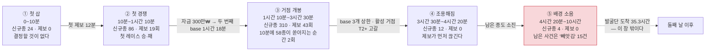
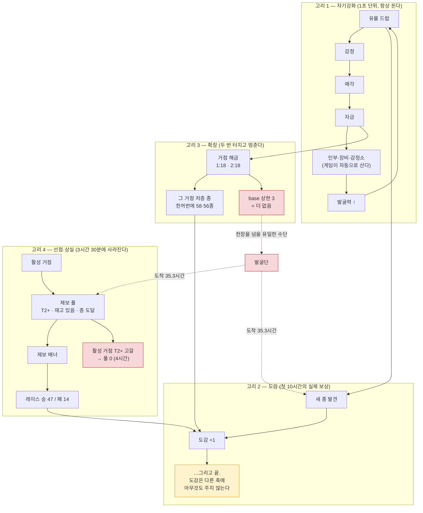
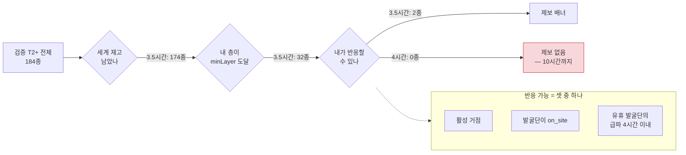
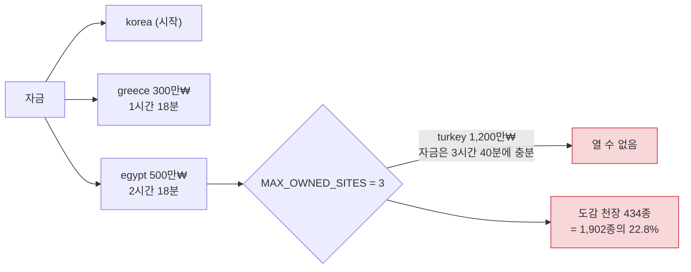
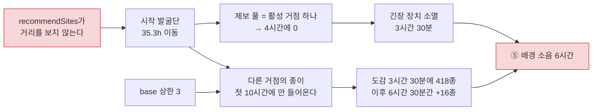

# 첫 10시간의 경험 지도 — 10분 단위

- 일자: 2026-09-20 (v0.3.4)
- 수집: `pnpm --filter relic-king playlog -- --hours 10 --bucket 10`,
  같은 명령의 `--hours 1 --bucket 1`(첫 시간 확대), 그리고 정체 구간의 원인을
  이름으로 부르기 위한 일회성 프로브(§5에 재현 코드 포함)
- 앞선 계측(168시간 전체)은 `notes/play-telemetry.md`, 게이트 원본은 `eval.md` §20·§21.

이 문서는 **첫 10시간만** 본다. 168시간 계측이 "엔딩까지 가는 길"의 지도라면,
여기는 **사람이 실제로 앉아 있는 시간대**의 지도다. 방치형이라도 첫 하루의
첫 10시간에서 계속할지 말지가 결정되므로, 이 구간은 다른 구간과 같은 해상도로
보면 안 된다.

---

## 0. 결론

**첫 10시간 중 게임이 살아 있는 구간은 앞의 3시간 30분이고, 남은 6시간 30분은
화면만 움직인다.** 운영 플레이(사람이 눌러야 할 것을 전부 눌러 주는 기준선)
기준으로 신규 종 436개 중 **420개가 첫 3시간 30분에** 들어왔고, 제보 62회는
**전부** 그 안에 있다. 3시간 30분 이후로는 종이 16개 늘고(그중 12개가 4시간
20분 전에 들어온다) 제보는 **한 번도 뜨지 않으며**, 소장 자산은 398억₩에서
10시간까지 **한 자리도 움직이지 않는다.** 그 사이에도 드랍은 10분당 225건씩
계속 나온다.

끊어지는 고리는 셋인데, **둘은 뿌리가 같다.**

1. **발굴단이 첫 10시간에 존재하지 않는다.** 시작 발굴단은 0분에 페루로 떠나
   **35.3시간 뒤 도착, 176.6시간 뒤 귀환**한다. 게임 자체의 추천 순위가 거리를
   전혀 계산에 넣지 않기 때문이다(`recommendSites` — 미방문 +1000점, 그 다음은
   종 수). 일본이라면 **1.3시간 도착·6.3시간 귀환**에 종 수는 페루의 92%다.
2. **제보가 3시간 30분에 말라 죽는다.** 제보는 "플레이어가 반응할 수 있는
   거점"에서만 뜨는데(`playerCanReactAt`), 발굴단이 이동 중이라 반응 가능한 곳은
   **활성 거점 하나뿐**이다. 그 거점의 T2+ 종을 다 가져가는 순간 풀이 0이 된다 —
   30분 간격 실측으로 13 → 15 → 10 → 2(3.5시간) → **0**(4시간)이고, 그 뒤
   10시간까지 0이다. 1번의 직접적인 결과다.
3. **새 종의 천장이 base 3개다.** `MAX_OWNED_SITES = 3`이라 레거시 단독 발굴이
   닿는 종은 세 거점의 것뿐이고, 그게 434종(22.8%)에서 멈춘다. 이 천장을 넘을
   유일한 수단이 발굴단인데, 그게 1번 때문에 첫 10시간에 없다.

즉 **하나를 고치면(추천이 거리를 보게 하면) 셋 중 둘이 같이 풀린다.** 이건 추정이
아니라 세 현상이 같은 함수에 걸려 있다는 구조적 사실이고, 실제 개선 폭은 고쳐서
다시 재야 안다.

---

## 1. 국면 다섯



각 국면의 성격은 "무엇이 늘어나는가"로 갈린다. 아래 수치는 §2 표를 구간별로
합산한 것이다(10분 격자에 맞춰 잘랐다).

| 국면 | 길이 | 신규종 | 10분당 | 제보 | 사람 조작 | 이 구간에서 **처음** 일어나는 일 |
| --- | ---: | ---: | ---: | ---: | ---: | --- |
| ① 첫 삽 | 10분 | 24 | 24.0 | 0 | 0 | 드랍·감정·도감·층 돌파 |
| ② 첫 경쟁 | 1시간 | 86 | 14.3 | 19 | 2 | 제보·레이스 승·레이스 패·미감정 매각·소장고 정원 초과·시설 확장 |
| ③ 거점 개봉 | 2시간 20분 | 310 | 22.1 | 43 | 13 | 거점 해금·유일(T4) 최초 획득 |
| ④ 조용해짐 | 50분 | 12 | 2.4 | 0 | 1 | — |
| ⑤ 배경 소음 | 5시간 40분 | 4 | 0.1 | 0 | 6 | 영구 상실·발굴단 슬롯·경매장 |

⑤의 의미 있는 이벤트 24건 중 15건이 **영구 상실**이다 — 내가 무언가를 얻는
사건이 아니라 남이 가져갔다는 통지다. 조작 6회도 "할 일이 생겼다"가 아니라
**돈이 남아서 살 수 있는 것을 산 것**이다(슬롯 해금 7시간 41분, 경매장 9시간
25분). 사건이 조작을 부른 게 아니라 조작이 혼자 일어난다.

---

## 2. 10분 단위 타임라인 (운영 플레이)

`pnpm --filter relic-king playlog -- --hours 10 --bucket 10`의 출력 그대로다.
"반복"은 드랍·감정·매각, "의미"는 도감·층·제보·레이스·상실·확장·전시 계열이다
(`app/src/sim/playlog.ts`의 `AMBIENT`/`MEANINGFUL` 정의).

```
구간        반복  의미  신규종  층↑  제보(승/패)  조작 │ 도감  발굴력      자금      자산  소장고 │ 처음
       0초    186    27     24    3      0(0/0)     0 │    24      19     2.1만₩     244만₩     24 │ 인부·장비·감정소 구매, 유물 드랍, 도감 신규 종, 감정 완료, 감정 후 매각, 층 돌파
   10분 0초    188    29     21    2      3(3/0)     0 │    45      53     1.0만₩    9445만₩     45 │ 제보 발생, 레이스 승, 제보 종료, 미감정 매각
   20분 0초    191    28     21    1      3(3/0)     0 │    67      67    11.9만₩     1.8억₩     73 │
   30분 0초    205    20     13    1      3(1/2)     0 │    79     121    97.4만₩     7.2억₩     90 │ 레이스 패
   40분 0초    207    16     10    0      3(1/1)     0 │    89     144     148만₩     8.0억₩    106 │ 소장고 정원 초과
   50분 0초    200    26     18    1      3(4/0)     1 │   107     153     104만₩    16.7억₩    131 │ 보관소·습도·복원·보안
   1시간 0분    207    11      3    0      4(3/1)     1 │   110     266     170만₩    17.7억₩    144 │
  1시간 10분    202    24     13    4      3(1/2)     3 │   125     273     4.2만₩    23.3억₩    168 │ 거점 해금
  1시간 20분    164    66     58    3      3(2/0)     0 │   182     273    87.1만₩    24.2억₩    226 │
  1시간 30분    181    45     39    1      2(3/0)     0 │   221     280     5.3만₩    35.0억₩    270 │
  1시간 40분    198    25     19    0      3(3/0)     2 │   238     280     280만₩    45.1억₩    294 │
  1시간 50분    197    20     14    0      3(3/0)     0 │   253     295     160만₩    57.4억₩    324 │
   2시간 0분    195    19     10    1      4(4/0)     0 │   262     472     323만₩    59.7억₩    353 │
  2시간 10분    198    20      8    4      3(3/0)     1 │   272     483    8,462₩     206억₩    378 │ 유일 최초 획득
  2시간 20분    168    67     56    3      4(2/2)     0 │   326     483     389만₩     207억₩    433 │
  2시간 30분    183    43     36    1      3(1/2)     2 │   362     483     397만₩     215억₩    475 │
  2시간 40분    197    26     21    0      3(2/0)     2 │   382     495     515만₩     219억₩    502 │
  2시간 50분    193    22     14    1      3(3/0)     0 │   396     518     341만₩     387억₩    532 │
   3시간 0분    189    14      8    0      3(3/0)     0 │   404     530    98.6만₩     394억₩    570 │
  3시간 10분    198    13      7    0      3(1/2)     1 │   411     530     678만₩     397억₩    595 │
  3시간 20분    205    13      7    0      3(1/2)     2 │   418     530     728만₩     398억₩    615 │
  3시간 30분    220     4      3    1      0(0/0)     0 │   421     541     287만₩     398억₩    620 │
  3시간 40분    219     6      6    0      0(0/0)     0 │   427     553    1201만₩     398억₩    626 │
  3시간 50분    224     1      1    0      0(0/0)     0 │   428     903     194만₩     398억₩    627 │
   4시간 0분    224     1      1    0      0(0/0)     0 │   429     921     469만₩     398억₩    628 │
  4시간 10분    224     1      1    0      0(0/0)     1 │   430     921    1339만₩     398억₩    629 │
  4시간 20분    225     0      0    0      0(0/0)     0 │   430     940    1386만₩     398억₩    629 │
  4시간 30분    225     1      0    1      0(0/0)     0 │   430     958    1005만₩     398억₩    629 │
  4시간 40분    224     1      1    0      0(0/0)     0 │   431     958    2158만₩     398억₩    630 │
  4시간 50분    223     2      2    0      0(0/0)     0 │   433     976    1566만₩     398억₩    632 │
   5시간 0분    225     0      0    0      0(0/0)     1 │   433     976    2530만₩     398억₩    632 │
  5시간 10분    225     0      0    0      0(0/0)     0 │   433     995    1305만₩     398억₩    632 │
  5시간 20분    224     1      1    0      0(0/0)     0 │   434    1592     167만₩     398억₩    633 │
  5시간 30분    225     0      0    0      0(0/0)     0 │   434    1592    1788만₩     398억₩    633 │
  5시간 40분    225     0      0    0      0(0/0)     0 │   434    1621     711만₩     398억₩    633 │
  5시간 50분    225     0      0    0      0(0/0)     0 │   434    1621    2350만₩     398억₩    633 │
   6시간 0분    225     0      0    0      0(0/0)     0 │   434    1651     551만₩     398억₩    633 │
  6시간 10분    225     4      0    0      0(0/0)     0 │   434    1651    1878만₩     398억₩    633 │ 영구 상실
  6시간 20분    225     3      0    0      0(0/0)     0 │   434    1651    3298만₩     398억₩    633 │
  6시간 30분    225     2      0    0      0(0/0)     0 │   434    1680     937만₩     398억₩    633 │
  6시간 40분    225     2      0    0      0(0/0)     0 │   434    1680    2294만₩     398억₩    633 │
  6시간 50분    225     3      0    0      0(0/0)     0 │   434    1680    3593만₩     398억₩    633 │
   7시간 0분    225     1      0    0      0(0/0)     0 │   434    1710     389만₩     398억₩    633 │
  7시간 10분    225     0      0    0      0(0/0)     0 │   434    1710    1919만₩     398억₩    633 │
  7시간 20분    225     0      0    0      0(0/0)     0 │   434    1710    3422만₩     398억₩    633 │
  7시간 30분    225     0      0    0      0(0/0)     0 │   434    1710    4660만₩     398억₩    633 │
  7시간 40분    225     3      0    0      0(0/0)     3 │   434    1710    1714만₩     398억₩    633 │ 발굴단 슬롯 해금, 단장 고용, 원정 파견
  7시간 50분    225     0      0    0      0(0/0)     0 │   434    1710    3530만₩     398억₩    633 │
   8시간 0분    224     0      0    0      0(0/0)     0 │   434    1739     222만₩     398억₩    633 │
  8시간 10분    225     0      0    0      0(0/0)     0 │   434    1739    1569만₩     398억₩    633 │
  8시간 20분    225     0      0    0      0(0/0)     0 │   434    1739    2830만₩     398억₩    633 │
  8시간 30분    225     0      0    0      0(0/0)     0 │   434    1739    4245만₩     398억₩    633 │
  8시간 40분    225     0      0    0      0(0/0)     0 │   434    1739    5891만₩     398억₩    633 │
  8시간 50분    225     0      0    0      0(0/0)     0 │   434    1769    1720만₩     398억₩    633 │
   9시간 0분    225     0      0    0      0(0/0)     0 │   434    1769    3905만₩     398억₩    633 │
  9시간 10분    225     0      0    0      0(0/0)     0 │   434    1769    5372만₩     398억₩    633 │
  9시간 20분    229     1      0    0      0(0/0)     2 │   434    1769    3833만₩     398억₩    629 │ 경매관장 고용, 경매장 건립, 경매 출품
  9시간 30분    225     0      0    0      0(0/0)     0 │   434    1769    5360만₩     398억₩    629 │
  9시간 40분    222     0      0    0      0(0/0)     0 │   434    2830     360만₩     398억₩    629 │
  9시간 50분    225     0      0    0      0(0/0)     0 │   434    2830    2009만₩     398억₩    629 │
```

읽는 법 세 가지.

**첫째, "의미" 열은 3시간 30분을 기점으로 두 자릿수에서 0으로 떨어진다.**
3시간 20분 구간까지 10분당 11~67건이던 것이, 4시간 20분 이후로는 34개 구간 중
**27개가 0 또는 1**이다(합쳐 24건, 그중 15건이 영구 상실). 그 사이 "반복" 열은
164~229로 한 번도 꺼지지 않는다 — **화면은 처음부터 끝까지 똑같이 바쁘다.**
이게 이 게임의 지루함이 "아무 일도 안 일어난다"가 아니라 "일어나는 일이 전부
같은 일이다"인 이유다.

**둘째, 신규종은 균일하게 오지 않고 두 번 터진다.** 1시간 20분대 58종,
2시간 20분대 56종. 둘 다 직전 10분에 **거점을 새로 연 것**의 결과다(1시간 18분,
2시간 18분). 새 거점은 그 거점의 저층 종을 한꺼번에 쏟아 내기 때문이다 — 이게
이 게임에서 가장 강한 보상 순간이고, 첫 10시간에 **두 번밖에 없다.**

**셋째, 3시간 30분에 자금과 자산이 갈라진 뒤 자산만 굳는다.** 자금은 167만~
5,891만₩ 사이를 계속 오르내리지만(들어오는 족족 시설로 나간다) 자산은
398억₩에서 10시간까지 한 자리도 안 움직이고, 소장고도 633점에서 멈춘다.
들어오는 드랍이 **전부 이미 가진 종**이라 자동 매각이 곧장 팔아 치우기
때문이다(§7). 화면의 숫자 중 유일하게 계속 오르는 것이 발굴력인데
(530 → 2,830), 그 발굴력이 캐 오는 것도 전부 이미 가진 종이다.

---

## 3. 첫 1시간을 1분 단위로

첫 국면은 10분 해상도로 보면 뭉개진다. `--hours 1 --bucket 1`로 다시 재면:

| 시각 | 그때 처음 일어나는 일 | 그 분이 끝났을 때 도감 |
| --- | --- | ---: |
| 10초 | 첫 드랍 | 6종 |
| 28초 | 첫 감정 완료 — 이름과 평가액이 열린다 | 6종 |
| 1분 34초 | 첫 매각(감정 후) | 9종 |
| 2분 10초 | 첫 층 돌파 | 13종 |
| 12분 0초 | **첫 제보** — 배너가 뜨고 그 안에 레이스 승 | 30종 |
| 14분 54초 | 첫 미감정 즉시 매각 | 34종 |
| 32분 30초 | **첫 레이스 패** | 69종 |
| 46분 | 소장고 정원 초과 경고 시작 | 85종 |
| 59분 | 첫 사람 조작(보관소 확장) | 107종 |

첫 12분은 **아무 긴장 없이 숫자만 오른다.** 분당 2~6종씩 도감이 열리고, 조작은
0회다. 이 구간의 경험은 "누르지 않아도 계속 열린다"이고 방치형의 첫인상으로는
맞다. 다만 **처음 12분 동안 플레이어가 내릴 수 있는 결정이 하나도 없다** —
정책이 첫 버튼을 누르는 시각이 59분이다(그 전까지는 살 수 있는 것도, 고를
것도 없다).

제보는 12분에 처음 뜨는데 **중앙 지속 15초**다(설계값 60~150초). 첫 시간에
15회가 뜨고 그중엔 10초 안에 닫힌 것도 있다. 이건 이미 알려진 결함이지만
(`notes/play-telemetry.md` §4, 처방 §7.3 미적용), 첫 10시간 관점에서 의미가
하나 더 붙는다 — **제보가 존재하는 유일한 구간이 0~3시간 30분이므로, 창이
짧다는 건 곧 "이 게임의 긴장 장치를 제대로 써 볼 기회가 아예 없다"는 뜻이다.**

---

## 4. 경험은 어떻게 연결되는가

첫 10시간의 모든 사건은 네 개의 고리로 묶인다. 굵은 화살표가 실제로 도는 것,
점선이 첫 10시간 안에서 **돌지 않는 것**이다.



고리 1은 **언제나 돈다** — 그래서 첫 10시간 내내 화면이 바쁘다. 그런데 고리 1의
산출물(자금·발굴력)이 흘러들 곳이 3시간 30분 이후 **없다.** 고리 3은 천장에 닿았고,
고리 4는 공급이 끊겼고, 고리 2는 새 종이 안 나오면 아무것도 아니다.

이 구조가 "④ 조용해짐"과 "⑤ 배경 소음"의 정확한 정의다: **고리 1만 남은 상태.**

그리고 고리 2에 굳이 노란 칸을 넣은 이유가 있다. 도감은 첫 10시간의 유일한
실질 보상인데, **도감이 늘어도 다른 축에 아무 영향이 없다.** 발굴력도, 자금도,
제보 확률도 도감을 참조하지 않는다(엔딩 판정의 CODEX_SCORE만 본다). 그래서
도감이 멈추는 순간 플레이어가 잃는 건 "진행"이 아니라 **진행의 유일한 증거**다.

---

## 5. 고리가 끊어지는 세 지점

### 5.1 발굴단 — 첫 원정이 35.3시간 뒤에 도착한다

v0.3.4에서 시작 발굴단을 넣고 루틴을 기본 켬으로 바꾼 것은(`notes/decisions.md`
G71) 탭만 열어 둔 플레이의 죽음을 막기 위해서였고, 168시간 스케일에서는 효과가
있었다(의미 있는 이벤트 317 → 2,090건). **그런데 첫 10시간에는 그 발굴단이
존재하지 않는다.**

```mermaid
gantt
    title 시작 발굴단의 첫 원정 (서울 기준) — 플레이어가 보는 10시간은 맨 왼쪽 끝
    dateFormat X
    axisFormat %s h
    section 실제 (추천 1위 = 페루)
    이동 35.3h          :0, 35
    현지 작업 106h       :35, 141
    복귀 35.3h          :141, 177
    section 만약 일본이었다면
    이동 1.3h           :0, 2
    현지 작업 3.8h       :2, 6
    복귀 1.3h           :6, 7
    section 플레이어가 앉아 있는 시간
    첫 10시간           :0, 10
```



원인은 게임 자신의 추천 함수다. `recommendSites`는 **미방문 거점에 +1000점을
주고 그 다음은 미보유 종 수**로만 순위를 매긴다 — 거리는 계산에 들어가지 않는다.
그 결과 t=0의 추천 1위가 지구 반대편인 페루다.

```
추천 순위(t=0): peru > egypt > china > rome > iraq > india > mexico > japan > greece > turkey > israel > korea
```

거점별 실측(단장 항해술 62 반영):

| 거점 | 검증 종 | 도착 | 현지 | 귀환 | 첫 10시간 안에? |
| --- | ---: | ---: | ---: | ---: | --- |
| **peru**(추천 1위) | 172 | 35.3h | 106.0h | 176.6h | ✗ 아무것도 |
| china | 169 | 3.9h | 11.7h | 19.5h | ○ 6시간 넘게 채굴 |
| **japan** | 159 | 1.3h | 3.8h | 6.3h | ◎ 한 바퀴 완주 |
| india | 161 | 10.3h | 31.0h | 51.7h | △ 도착만 |
| rome | 169 | 19.4h | 58.3h | 97.1h | ✗ |

일본은 페루의 **92% 종 수**를 가지고 있으면서 **첫 세션 안에 왕복이 끝난다.**
발굴단은 도착 즉시 실시간으로 드랍을 만들기 때문에(`applyDigProgress`, 귀환은
원정비 정산만 한다) 차이는 "언제 돌아오느냐"가 아니라 **"언제부터 무언가를
주느냐"**다 — 1.3시간과 35.3시간의 차이다.

여기엔 판단이 필요한 부분이 있다. 먼 거점이 더 좋은 건 설계 의도이고(거리가
비용·미스헵·원정비에 다 걸려 있다), "가까운 데부터"가 항상 옳지도 않다. 문제는
**첫 원정에서 그 선택을 게임이 대신 하면서 가장 먼 곳을 고른다**는 것이다.

### 5.2 제보 — 3시간 30분에 끊기고, 4시간에 공급이 0이 된다

제보가 뜨려면 네 조건을 다 통과해야 한다(`spawnTip`).



30분 간격 실측(운영 플레이):

| 시각 | 재고 통과 | 층 통과 | **반응 가능** | 어느 거점 |
| ---: | ---: | ---: | ---: | --- |
| 0.5h | 184 | 13 | 13 | korea |
| 1.0h | 184 | 15 | 15 | korea |
| 1.5h | 184 | 30 | 15 | greece |
| 2.5h | 183 | 40 | 10 | egypt |
| 3.5h | 174 | 32 | **2** | egypt |
| 4.0h | 169 | 27 | **0** | — |
| 10.0h | 144 | 17 | **0** | — |

세 번째 열(층 통과)은 10시간에도 17종이 남아 있다. **유물이 없어서가 아니라
갈 수 없어서** 제보가 안 뜬다. 발굴단은 셋 중 둘(r2·r3)을 책임지는데 35시간째
이동 중이고, 유휴 팀이 없으니 급파도 불가능하다 — 5.1의 직접적 결과다.

그리고 재고 열은 계속 줄어든다(184 → 144). 그 40종은 **라이벌이 가져간 것**이다.
첫 10시간의 마지막 6시간에 화면에서 일어나는 유일한 "의미 있는" 사건이
영구 상실 15건인 이유다(6시간 10분부터). 168시간 계측에서 탭만 열어 둔 플레이를
두고 쓴 문장이(§1.1 "그 정적 속에서 유일하게 일어나는 일이 빼앗기는 것이다")
**운영 플레이의 첫 10시간에도 그대로 적용된다.**

### 5.3 새 종 — base 3개가 천장



여기서 짚을 점은 **돈이 없어서 막힌 게 아니라는 것**이다. 네 번째 거점
(turkey, 1,200만₩)의 비용은 4시간 30분 시점 자금 1,566만₩으로 이미 충분하다.
base 슬롯 상한이라는 **규칙** 때문에 막힌 것이고, 그건 설계 의도다
(`notes/world-map.md` §5 — 원정이 그 역할을 대신하라는 구조). 문제는 그 대체재가
5.1 때문에 첫 10시간에 없다는 것이다.

세 그림을 겹치면 이렇게 된다.



---

## 6. 탭만 열어 둔 플레이는 어디서 갈라지나

같은 10시간을 아무것도 누르지 않고 두면(`idle`) 이렇게 갈라진다.

| | 탭만 열어 둠 | 운영 | 갈라지는 시점 |
| --- | ---: | ---: | --- |
| 도감(10시간) | 126종 | 434종 | **1시간 18분** (첫 거점 해금) |
| 새 종이 사실상 멈춘 시각 | 2시간 40분 | 3시간 30분 | — |
| 의미 있는 이벤트(건수 합) | 277건 | 611건 | — |
| 반복 : 의미 | 47.0 : 1 | 21.0 : 1 | — |
| 제보 | 57회 (첫 14분 30초) | 62회 (첫 12분) | 거의 같다 |
| 영구 상실 | 24건 (첫 3시간 44분) | 15건 (첫 6시간 10분) | — |
| 사람 조작 | 0회 | 22회·59단계 | — |
| 소장고 | 357점 고정 | 633점 고정 | — |

**갈라지는 유일한 지점이 거점 해금이다.** 탭만 열어 두면 base가 korea 하나뿐이라
도감 천장이 126종이고, 그게 2시간 40분에 도달된다. 운영 플레이의 434종은 base
세 개의 합이다. 조작 22회가 만든 차이의 거의 전부가 **버튼 두 번**(거점 해금
2회)에서 나온다 — 나머지 20회(시설·경매장·슬롯)는 도감을 1종도 늘리지 않았다.

이건 이미 168시간 계측에서 나온 "가장 많이 누른 날이 가장 적게 얻은 날"
(`play-telemetry.md` §2.2)의 10시간 판이다.

---

## 7. 경제와 소장고가 멈춰 보이는 이유

자산이 3시간 30분(398억₩)부터, 소장 점수가 5시간 20분(633점)부터 10시간까지
고정인 것은 버그가 아니라 **평형**이다. 들어오는 드랍이 전부 이미 가진 종이라, 게임의 기본 자동화
(`autoSellVaultSpares` — 종당 1점만 남기고 판다)가 들어오는 족족 팔아 치운다.
그래서 소장고 점수는 그대로, 자금만 오르내린다.

부수적으로 확인된 것 둘.

**소장고 정원 초과가 46분부터 9시간 넘게 상시다.** 보관소 Lv.6의 정원은
300점인데(`VAULT_CAPACITY_BASE 100 + 40 × 5`) 실제 보유는 633점이라 2.1배다.
정원 초과는 보존 저하 확률을 2배로 올린다(`VAULT_OVERFLOW_CONDITION_DECAY_MULT`).
다만 **이건 정책의 한계이기도 하다** — 시뮬 정책이 보관소를 Lv.6에서 멈추도록
쓰여 있고(`sim/policy.ts`), 엔진에는 레벨 상한이 없다. 실제 플레이어는 더 살 수
있다. 그래도 경고는 9시간 내내 화면에 떠 있고, 자동화는 그 경고에 반응할 규칙이
없다 — 즉 **"화면이 계속 경고하는데 게임의 자동화는 그걸 무시한다"**가 첫
10시간의 실제 모습이다.

**경매장이 9시간 25분에야 선다.** v0.3.4가 자동화한 경매 출품 경로
(`notes/decisions.md` G72)는 경매장이 있어야 열리므로, 첫 10시간에는 그 처방의
효과가 거의 없다(출품 4건). 첫 세션의 환금은 전부 직접 매각이다.

---

## 8. 처방 후보 — 미적용

순위는 **"3시간 30분 이후의 죽은 6시간 30분을 얼마나 되살리는가"** 기준이다.
전부 아직 적용하지 않았다 — 밸런스 축을 건드리므로 결정이 필요하다.

**① 첫 원정만은 가까운 곳으로 (가장 먼저).** `recommendSites`에 거리 항을
넣거나, 최소한 **첫 원정 한 번**은 왕복이 세션 안에 끝나는 거점으로 보낸다.
일본이면 도착 1.3시간·귀환 6.3시간에 종은 페루의 92%다. 이 하나로 5.1이
풀리고, 그 결과로 5.2의 제보 풀에 거점이 하나 더 붙는다(발굴단 on_site).
**부작용 추정**: 먼 거점의 높은 기대수익을 나중으로 미루므로 중후반 성장이
느려질 수 있다 — `sim --hours 168`의 엔딩 시각(현재 140시간 39분)으로 확인해야
한다. 추정이지 측정이 아니다.

**② 제보 풀에 "곧 반응 가능"을 넣는다.** 지금은 반응 수단이 없으면 제보 자체가
안 뜬다. 이동 중인 발굴단의 목적지도 반응 가능으로 치면(도착 후 추격),
3시간 30분 이후의 0이 사라진다. 다만 이건 "놓치면 영영"의 긴장을 희석할 수 있어
③과 충돌한다.

**③ 제보 창(이미 §7.3에 올라와 있던 것).** 중앙 15초는 설계 60~150초의 1/4이다.
첫 10시간 관점에서 우선순위가 올라간 이유는 §3에 적었다.

**④ base 4번째 슬롯을 첫날 안에 연다.** 5.3의 천장을 직접 올린다. 척추 2번
(깊이는 희소성만 연다)과 충돌하지 않지만 base 상한의 설계 의도
(`world-map.md` §5)와는 정면으로 부딪히므로, ①이 먼저다 — ①이 통하면 ④는
필요 없을 수 있다.

**⑤ 도감에 되먹임을 준다.** 고리 2의 노란 칸이다. 도감이 다른 축에 아무것도
주지 않는 지금, 도감 정지는 곧 경험의 정지다. 다만 이건 밸런스가 아니라 설계
변경이라 별도 논의가 맞다.

---

## 9. 재현

```bash
pnpm --filter relic-king playlog -- --hours 10 --bucket 10   # §2 표
pnpm --filter relic-king playlog -- --hours 1  --bucket 1    # §3 표
```

`--bucket N`은 이 문서를 위해 `app/src/sim/playlog.ts`에 추가했다. 구간별
이벤트 수와 함께 **구간 끝의 세계 상태**(도감·발굴력·자금·자산·소장고)를 같이
찍는다 — 이벤트만으로는 "그때 화면에 뭐가 떠 있었나"를 알 수 없기 때문이다.
`--json`에도 같은 샘플이 들어간다.

§5의 진단 수치(제보 풀 단계별 통과 수, 발굴단 도착·귀환, 거점별 거리)는
일회성 프로브로 뽑았다. 같은 값을 다시 얻으려면:

```ts
// 제보 풀이 어디서 걸리는지 — spawnTip의 필터를 그대로 재현한다
import { ARTIFACTS } from "./app/src/game/artifacts";
for (const a of ARTIFACTS) {
  if (a.tier < 2 || a.sourceStatus !== "verified") continue;      // 184종
  if (w.ledger[a.id].remaining <= 0) continue;                     // 재고
  if (a.minLayer > w.sites[a.site].layer) continue;                // 층
  // 반응 가능: w.activeSite === a.site
  //          || 발굴단이 on_site && targetSite === a.site
  //          || 유휴 발굴단이 있고 급파 압축 이동 ≤ 4시간
}
```

```ts
// 발굴단 도착·귀환 — dispatchExpedition과 같은 식
const travel = travelHoursOneWay(distanceKm("korea", target), foreman.navigation);
const onsite = onsiteHoursOf(travel);          // max(0.1, travel × 3)
// 도착 = travel, 귀환 = travel × 2 + onsite
```

계측은 결정론적이다 — 같은 명령을 다시 돌리면 같은 표가 나온다(RNG가 World에
들어 있고 시드가 고정이다).

---

## 10. 이 측정의 한계

- **시드 1개다.** 제보 횟수·레이스 승패·드랍 순서는 시드에 따라 흔들린다.
  반면 §5의 세 원인(추천 순위, 제보 풀 필터, base 상한)은 **시드와 무관한
  구조**다 — 거리·상한·필터는 난수가 아니다. 국면 경계 시각(3시간 30분 등)은
  시드에 따라 앞뒤로 움직일 수 있다고 보는 편이 맞다.
- **두 정책은 사람이 아니라 양 극단이다**(`eval.md` §20.8과 같은 한계).
  "운영"은 살 수 있는 것을 즉시 사는 기계이고, 실제 사람은 그보다 느리게
  움직인다. 그러니 §2의 국면 경계는 **사람이 겪을 수 있는 가장 빠른 경계**로
  읽어야 한다 — 사람은 더 늦게 도달하지, 더 일찍 도달하지 않는다.
- **UI를 실제로 클릭해 재지 않았다.** 조작 횟수는 엔진 이벤트이고, 단계 수는
  `eval.md` §20.3의 UI 실측 표를 곱한 값이다. "그 화면에서 그게 실제로 눌리는가"는
  `pnpm play`가 따로 검증한다.
- **"경험"이라는 말의 범위.** 여기서 잰 것은 이벤트의 발생과 그 간격이다.
  같은 이벤트가 화면에서 얼마나 잘 보이는지(연출·알림 등급)는 이 계측 밖이고,
  `notes/ux-v02.md` §1.4와 `eval.md` §19의 몫이다.
